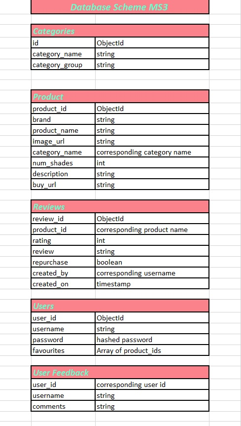

# **Spill the Beau-Tea**

### **You can check out Spill the Beau-Tea** [Here](https://spill-the-beau-tea.herokuapp.com/)

## **_Milestone Project 3 - Data Centric Development_**

## **Project Description**
This project is a makeup review website, developed with the purpose of providing real, honest and authentic reviews on makeup products. It allows users to add, edit and delete their own content. The makeup industry has grown exponentially over the last decade, there is a vast amount of products to choose from and a growing number of sites to purchase from. Makeup is an art, it provides a way for people to express themselves. With the growth of influencers, the idea of trustworthy reviews has become an issue in mainstream society. The people promoting these products have a lot to gain from the results of pushing product sales. With this in mind, I decided to develop a review site that allows everyday users to add their opinion on products, and also see product reviews left by other users. The user can then add products to their favourites, which is a list of products the user wants to buy. The inspiration for this project was from personal experience. I am always on the hunt for good makeup products to buy, but it can be so easy to get lost in the sea of information, and false advertising. It's difficult to trust reviews you see on Instagram, or on sites where they are selling these products. This site acts as a sort of makeup forum, with the hope of providing a tips and tricks section, or makeup tutorials section in the future and hopefully providing a platform by which users can connect with each other through their love for makeup.

### **_Business Objectives_**
- Create a trustworthy community for makeup enthusiasts. Provide users with up-to-date products and product information.
- Provide a website that is inviting and attractive to users.
- Provide users with authentic content.
- Provide a website that is easy to navigate.
- Encourage users to want to add content to the site.
- Allow users to create a profile and build a 'to buy' list of all their favourite products.
- Help users to find the products they are looking for.

### **_Customer Objectives_**
- To establish the purpose of the website immediately.
- To easily navigate the website.
- To be able to quickly search for the products they are looking for.
- A website that is attractive, inviting and interesting.
- To browse products and their reviews easily.
- To have the ability to create their own profile.
- To add reviews to products.
- To add a rating within the product review.
- To generate a list of favourite products.
- To have the ability to remove products from the favourites list.
- To have the ability to edit and delete their own content.
- The ability to delete their account.
- To have access to product stockists.

### **_Future Goals_**
- Provide users with links to where the product can be bought.
- Allow users to comment on other user reviews.
- Allow users to like/upvote other user reviews.
- Provide the ability for users to interact with each other through chat/message.
- Provide a 'Tips & Tricks' blog section on how to use products, makeup hacks etc.
- Provide the means for users to upload video content to show how to apply products etc.
- To provide a contact admin section by email, for user queries or suggested products to be included in the site

## **UX**
This website was designed for makeup lovers who are looking for honest product reviews, from everyday makeup users. The aim of the website is to allow users to identify, browse and comment on the products they like  or dislike and if they are worth purchasing. The design of this website is fun and inviting, with the use of vivid imagery and a bright and vibrant colour palette. The idea is to to create a reliable review platform for users, and encourage users to want to sign up, create content, and express their honest opinions on products. It is user-friendly, and easy to navigate with clear calls to action.

### **_User Stories_**
- As a user I would like to understand the purpose of the website.
- As a user I want to be able to create my own profile that holds all my content.
- As a user, I want to be able to navigate the website with ease.
- As a user, I would like the ability to edit and delete the content I create.
- As a user I want to access reviews posted by other users.
- As a user, I want the ability to provide a rating for the product I am reviewing.
- As a user I would like to add my favourite products to my profile.
- As a user, I want to be able to delete my account.
- As a user, I want the ability to search for products by name, brand or category.
- As a user, I would like to add a review to any product available on the website.
- As a user, I want the ability to remove products I have added to my favourites list.
- As a user, I want the site to visually identify if a product has already been added to my list of favourite products.
- As a user I would like the ability to be able to communicate with the website admin team.
- As the owner and user, I want to provide a platform that encourages users to get involved and create  content.
- As the owner and user, I want to provide users with relevant and current product information.
- As the owner and user, I want a website that is fun, vibrant and inviting.
- As the owner and user, I want to be able to add, update or delete products on the website.
- As the owner, I want to be able to remove any reviews or users if necessary. (e.g. inappropriate content)
- As the owner and user, I want the ability to create, update and delete categories.
- As the owner and user, I want other users to be able to give feedback, and provide suggestions for products they would like included on the website.
- As a guest user, I would like to be able to search for products, and see the associated reviews without the ability to add/edit/delete reviews.

### **_Strategy Plane_**
- The aim of this project was to develop a makeup review website that provides honest real reviews on makeup products, from everyday users real life experience using the products. The website is vibrant, energetic, fun, inviting, and easy to navigate.
- This website was designed with a focus on user experience and user needs, with the aim of encouraging users to join and create content. With this in mind, I made the decision to include pre-populated products, for an easier user experience. A lot of information would need to be sourced to add a product, which might be discouraging to users when adding content to the site. It is designed so only admin users can add/edit products, and users can add reviews to the products, and edit and delete these from their profile. 
- I have also included a user feedback modal, so that users can communicate with admin on suggested products to add to the site, or provide feedback on site improvements. These feedback comments can then be seen by admin, in the user feedback section on the admin profile, and deleted as necessary.
- This project should be a go to for users when researching makeup products. There are so many makeup product websites and blogs, it is hard to distinguish between them, so I wanted this project to provide a more interactive, and enjoyable way of experiencing this type of website.

### **_Scope Plane_**
- The priority for this project was to create a database of popular user products available on the market, and allow users to create, edit, and delete reviews for these products, while also having access to view other user reviews.
- It was extremely important that the site’s purpose was immediately evident, and that it was fun, and attractive to users. It needed to be vibrant with a clear layout, and easy to use navigation.
- Given my timeframe and skills, my focus was on ensuring that users had control of their own content, to provide a profile where this content could be accessed together, and to provide as many benefits to the user as possible.
- I decided to pre-populate the site's products, and product information, for ease of use, while also providing a means of communication between admin and users. This feedback functionality is so that users can be more involved in content creation, and site improvements.This would allow the Admin team to keep track of areas for improvement, and really deliver the content that the user is looking for.
- The site needed to be easy to use, so it was necessary to include search bars on the homepage, products page and product information pages. I want to ensure that the user can search by product name, brand or category name. This would allow the user to navigate to different items with ease, while also having the navigation bar menu displayed at all times, if they wish to navigate to the homepage, profile, sign out or login and category pages.
- The products page contains a list of products, depending on the item searched or category chosen. Each product shows the user the average reviews, and also the number of reviews for each product, which acts as a link to that product’s reviews. Also included is a button ‘More Info’, that allows the user to navigate to further information, and reviews on that specific product.
- The use of vivid images, and minimal text on the category and product pages, was done so that the user isn't overwhelmed with information, but has the option to get more information about a specific product if they want. The product info page is where they can see product reviews, add a review, or delete a review they've added.The product information shows a limit of 5 reviews for each product, but there is a ‘More Reviews’ button located underneath, to take the user to all the product reviews for that specific item.
- To make navigation easy for the user on the reviews page, I have provided a button that brings the user back to the product information, of that specific item.
- It was also essential that users could create a list of favourite products, and have the ability to add and remove these products whenever they wished to do so. I've included favorite buttons on each product and product information page, that immediately indicates to the user whether the product has been added to this list or not. This is done by using a heart icon, that toggles from outlined to full color, depending on whether the product is in the user's favorites list.
- The user profile welcomes the user with a visual greeting on signing in, and includes an accordion list of their favourite products, a button for leaving feedback comments, the reviews they have created, and a button to delete their account if necessary.
- The admin profile contains a different layout, showing an accordion menu with management items, such as all reviews with the ability to delete these, all users with the ability to delete a user account, user feedback with the ability to delete comments and adding, editing, products and categories for the site.
- Along with this, I wanted the site to be accessible to all, but with extra features/benefits for registered users. The products and reviews can be seen and accessed by everyone who visits the site, but only registered users can add reviews and add their favourite products.

### **_Structure Plane_**
- The structure of this website was designed to be easy to navigate and user-friendly. The navigation bar is visible on every page, and includes different links depending on whether a user is logged in, a guest user or the admin user. It is a vibrant, fun and inviting site, using vivid images and a bright colour scheme, designed to capture the attention and pique the interest of the user.
- The homepage is simple and straightforward, with a bright full-screen background image, and a jumbotron with minimal text that states the website's purpose.A search bar and two call to action buttons, 'Register' and 'Sign In', are also included to encourage the user to create an account. These button are only visible if the user is not logged in. The navigation bar includes a dropdown menu of product category groups, that takes the user to a list of product categories within that group. These are designed using card layout, with a top image, and the product category underneath with a search icon. This will lead the user to the products within the specific category. Minimal text is used here so as not to overload the user with information.
- The products page is designed in a similar layout, using a card structure, with product images and a card with basic product information. The product card includes name, brand, average rating, number of reviews, price and number of shades that are available. It also has a heart icon available to registered users, which will add or remove a product from the user favourites list. It also contains a button 'More Info', that will lead the user to more in-depth information on the specific product.
- The product information page is a card layout, with product image, and product information which includes product name, brand, description, price, average rating and shades available. It also has a heart icon available to registered users, which will add or remove a product from the user favourites list. A button to add a review is available to registered users, and the most recent 5 reviews for that product are shown in card layout, below the product card. At the bottom of the page, under the most recent reviews, is another button, 'More Reviews', which leads the user to the remaining reviews for this product.
- Both the products page and the product information page have a search bar at the top, to allow users to search for different products, by product name, category or brand.
- The reviews page is a card layout, displaying all reviews related to that specific product. Reviews contain a title, star rating, review, user who the review was added by, and the date it was created. This page also contains a button, that will bring the user back to the product information page of the related product.
- The register and login pages can be accessed from the home page, and the navigation bar. It is a basic form which includes fields, username, email and password for signing up and username and password for signing in. These pages also contain links to either page, if the user is on the incorrect one.
- When users register, they have a profile which can be accessed by the navigation bar once they logged in. This page includes a header with the users' names, a list of their favourite products, a button to submit user feedback to admin through a modal, and below this is a list of the reviews the user has created, and a button to delete their account.
- All user functionality, i.e adding and editing content, is done through the use of modal popups, and buttons to delete items. A sweetalert popup appears when the delete buttons are clicked, to confirm any data deletes made on the site.
- The admin user has a slightly different layout on the profile page, which consists of an accordion menu, which allows them to access a list of all users, a list of all reviews, a list of all feedback. These links direct the user to the relevant pages, and gives the admin user the ability to delete any of these list items from the database. It also includes a manage button, to allow the admin user to add, edit or delete a product or category.
- Guest users can view the categories page, products page, product info page, and reviews page, but they cannot access any functionality, such as adding, editing, or deleting reviews.
- Flash messages are used to alert the user when any action has been taken, and are displayed at the top of the page. They are programmed to dropdown and timeout after a few seconds.

**Here is the site layout for this project:**

### **Database Architecture**
The database for this project was created using MongoDb. It consists of 5 collections: 
- Categories - stores the category name and category group
- Products - stores the product name, brand, category name, description, price, number of shades, image url, url link to where to purchase
- Reviews - stores the product id, review title, rating, review content, username who created the review and the date it was created
- Users - stores the username, email, password and an array of favourite products(product ids)
- User Feedback - stores the user id, name and comments
- I used the subset pattern for the reviews as each product in the products collection could potentially have numerous reviews so it made sense to split the products and reviews into two separate collections to reduce the size of the product documents.
- The collections were structured as follows:

### **_Skeleton Plane_**
This project contains multiple pages, with some pages displaying different elements based on the level of user: Admin user, guest user and registered user. It incorporates CRUD functionality for registered users, and admin users, in a variety of different elements. It also includes delete confirmation popups to ensure the delete functionality is authorised/confirmed by the user or admin user.
This project layout contains the following pages:
- Homepage
- Categories Page
- Products Page
- Product Information Page
- Reviews Page
- Login Page
- Register Page
- User Profile Page
- Admin Profile Page
- Add Category Page (Admin Only)
- Edit Category Page (Admin Only)
- Add Product Page (Admin Only)
- Edit Product Page (Admin Only)
- Manage Users Page (Admin Only)
- User Feedback Page (Admin Only)

The registered user CRUD functionality is all accessed through modal forms which include:
- Add Review Modal
- Edit Review Modal
- Contact Us Modal

### **_Wireframes Mockup_**
**Wireframes:**
- Desktop Wireframes can be viewed [here](wireframes/desktop)
- Tablet Wireframes can be viewed [here](wireframes/tablet)
- Mobile Wireframes can be viewed [here](wireframes/mobile)

- The wireframe design didn't really deviate from the original concept, except for the addition of further CRUD functionality, and a few extra features such as a contact modal, and including the user favourites on the profile page instead of a separate page for products favourited by users. Also I did not get to implement the use of a user profile image at this point in the project. It has always been the plan to include plenty of images, with minimal text, and provide a user friendly, fun and inviting website.

### **_Surface Plane_**
#### **_Colours_**
- The colour palette chosen for this project is bright, fun, and vibrant. After doing some research into similar sites, I found that many makeup product sites are very similar in design, using white background and black text, however I wanted my website to stand out amongst the crowd, and decided to use pink, turquoise and yellow as the theme. Makeup is about expressing yourself, and allows people to be creative and fun when using products, also bright colours are extremely popular in makeup products at the moment. 
- I wanted people to be visually attracted to the website, and wanted to pique the interest of the user, so they would be encouraged to join and create content. Today, people have to visit a variety of instagram accounts to get access to product reviews, with each influencer promoting a different product, but sometimes it can be hard to trust those reviews, as many influencers get paid to review makeup products. I wanted to create a space for the everyday makeup lover, a place they could go to express their real honest views on makeup products, and allow them to keep a record of these items all in one space. 
- The main background I have kept white, for the purpose of not overshadowing the images. The card layout and accordions are a variety of turquoise with pink text, or pink with turquoise text. Yellow is used for the ratings, call to action buttons/or button text. I have keep the body of content such as review content and product descriptions black, purely to make the content easy to read, and clear, for the user.

#### **_Typography_**
- The fonts chosen for this project were 'Dancing Script' for the logo and headers, as it has a nice design, a creative feel, and is visually attractive. The body of the website uses the font 'Lato' as it reads well, and doesn't distract from the actual content of the site, while still visually appealing. 

#### **_Images_**
The images for this site were sourced from a variety of locations:
- The homepage background image was sourced from [Pexels](https://www.pexels.com/photo/colored-powders-and-brush-1749452/)
- The 404 background image was sourced from [Unsplash](https://unsplash.com/s/photos/liz-breygel-broken-makeup?utm_source=unsplash&utm_medium=referral&utm_content=creditCopyText">Unsplash)
- The category and product images were sourced from a range of other sites including:
    - [Beauty Bay](https://www.beautybay.com/)
    - [Pop Sugar](https://www.popsugar.co.uk/)
    - [Get The Gloss](https://www.getthegloss.com/)
    - [Allure](https://www.allure.com/)
    - [Pinterest](https://www.pinterest.ie/)
    - [Fabulous Makeup](https://www.fabulousmakeup.co.uk/)
    - [Boots](https://www.boots.ie/)
    - [Cult Beauty](https://www.cultbeauty.com/ie/en/)
    - [Look Fantastic](https://www.lookfantastic.ie/)
    - [Brown Thomas](https://www.brownthomas.com/)
    - [Catrice Cosmetics](https://catrice.eu/en/index.html)
    - [Kaggle](https://www.kaggle.com/oftomorrow/herokuapp-makeup-products)

## **Features**
### **_CRUD Functionality_**
In this project I wanted to implement as much CRUD functionality as possible
The CRUD functionality for this website works as follows:

#### **Users Can:**
- Create an account
- Add a Review
- Edit their own Reviews
- Delete their own Reviews
- View all Reviews
- View all their content on their profile
- Add a Product to their Favourites
- Delete a Product from their Favourites
- Add user feedback
- Delete their own account

#### **Admin Can:**
- Add a Category
- Edit a Category
- Delete a Category
- Add a Product
- Edit a Product
- Delete a Product
- View all Reviews
- Delete any Review
- Delete a User Account
- Delete their own account
- View all User Feedback
- Delete User Feedback

#### **Guest Users Can:**
- Create an account
- View all Categories
- View all Products
- View all Reviews

### **_Navigation Bar & Footer_**
- The **navigation bar** is in a fixed position.
- Access to navigation elements on all pages for a user friendly experience.
- Consists of a **logo** to the left, which acts as a link back to the homepage, and **navigation links** to the right. These navigation links differ depending on the user status: 
- A guest user has access to:
    - Homepage 
    - Categories -( which is a dropdown menu of the category groups currently available on the website)
    - Sign in
    - Register.
- A registered user has access to:
    - Homepage
    - Categories - ( which is a dropdown menu of the category groups currently available on the website) - - User Profile
    - Sign out.
- An admin user has access to:
    - Homepage
    - Manage dropdown menu(which holds links to all categories, add a category, all products, add a product)
    - Profile
    - Sign out
- The navigation bar is **responsive**, and the links collapse into a **hamburger menu** for both 
tablet and mobile devices. 
- The footer is fixed at the bottom, and contains **copyright information** located in the center. 

### **_Homepage_**
- The homepage consists of a full width height, **responsive image**
- Contains a **callout jumbotron**, which is the title of the website, and a brief introduction to the purpose of the website.
- Directly under the callout, there is a **search bar**, which allows the user to search for products on the website, by category name, product name or product brand. This is clear to the user and displayed as the placeholder text. 
- There are two **call to action buttons**, one 'Register', which will take the user to the register page to create an account, and another 'Sign In', to take the user to the sign in page to log into their account. These buttons are hidden when a user is already logged into the website.

### **_Categories_**
- Accessed through the category group **dropdown menu** on the navigation bar.
- This will lead the user to the product categories within that category group.
- Includes a **header**, telling the user which category they are viewing. 
- Displayed in **card layout**, with a top image, and the category name underneath. 
- Includes a hidden **search input** that is labelled 'Explore category products', and a **search icon**. - When clicked, this will direct the user to the list of products within this category, and will be displayed on the products page.
- For Admin users only, each category has two **buttons** available to them. 'Edit Category' and 'Delete Category'. 
- 'Edit Category' button directs the user to the edit category form page, to allow them to edit the category
- 'Delete Category' button, once clicked, will trigger a **sweet alert popup** asking the user if they definitely want to delete that category. The user has the option to cancel or confirm the delete. 
- Cancel directs the user back to the categories page. 
- Confirm deletes the category selected, and removes from the database.

#### **_Add A Category_**
- Only accessible to admin users. 
- Admin has access to this page either from the 'Manage' **dropdown menu** on the navigation bar, or the **accordion menu** on the Admin profile page. 
- 'Add Category' page is a displayed as a **form** to be completed by the user. 
- Includes fields for the category name, and a **dropdown select input** to choose a category group from the category groups available in the database. 
- There are two **buttons** located at the bottom of the form, 'Cancel', which redirects the user back to the 'Categories' page and the 'Add Category' button, which will submit the form, and insert the new category into the database in MongoDb.
- The user is alerted it has been added via a **flash message** at the top of the screen.

#### **_Edit A Category_**
- Only accessible to admin users. 
- Admin can be access this **button** from the categories page. 
- Allows user to edit a specific category.
- User is directed to the Edit Category page, which is a **form layout**.
- Includes fields for category name, and a **dropdown list** of category groups to choose from. 
- The information is pre-populated, with the specific category information from the database.
- Allows the user to edit, and update the category in the database in Mongodb.
- The user is alerted it has been updated via a **flash message** at the top of the screen.

#### **_Delete A Category_**
- Only accessible to Admin users
- Accessed on the categories page, where each category has a **call to action button** 'Delete Category'. 
- Once clicked, a **sweetalert popup** is triggered, and will ask the user to confirm the delete function. 
- Cancel will redirect the user back to the categories page. 
- Confirm deletes the category, and removes it from the database 
- The user is alerted it has been deleted via a **flash message** at the top of the screen.

### **_Products_**
- Registered users and guest users can access the products page using the **search bar** functionality on the home page, or through the category pages from the navigation bar **dropdown menu**.
- Registered users have access to an extra feature, that is unavailabe to guest users, a clickable **heart icon** on the product information card. Once clicked, will add or remove the product to/from the user favourites list depending on the **toggle state** of the icon.
- The icon toggles between full colour and outline depending on whether the item has been added to the user favourites or not.
- Admin users can access the products page through the 'Manage' dropdown menu on the navigation bar, or using the same avenues as the registered or guest users.
- Displays a list of products in **card layout**, which include the product image, and basic product information( product name, average rating, no. of reviews, price, number of shades available) 
- Includes a  **button** 'More Info', which, when clicked, takes the user to more detailed information on that specific product and the most recent 5 reviews for that product.
- The number of reviews acts as a **link** for users, to be taken directly to all reviews associated with this specific product.
- Admin users have extra features on the products page: two **buttons**, 'Edit Product' and 'Delete Product'.

### **_Product Info_**
- The product info page displays only one product with more detailed information about that product.
- Also includes the most recent 5 reviews for the product. 
- Has a card layout, with a product image, and product information(product name, brand, average rating, description, price, number of shades available).
- For registered users only, a **call to action button** is displayed 'Add A Review', which triggers a **popup moodal** form, to allow the user to add a review to the product.
- A clickable **heart icon**, acts as a user favourites button, located on the product information card, which is only available to registered users. 
- The heart icon, when clicked, will add or remove the product to/from the user favourites list, depending on the toggle state of the icon.
- The icon toggles between full colour and outlined colour, depending on whether the item has been added to the user favourites or not.
- At the bottom of the page there is a **button** 'More Reviews', which takes the user to the reviews page, where all reviews for that product are displayed.
- If a registered user has created a review which is displayed, they will have access to a button 'Delete Review' on the review, which will allow them to delete that review.
- At the top of the page there is a **button** 'Bck to Categories', which takes the user to the All Categories page, where all categories in the database are displayed.

#### **_Add A Product_**
- Only available to admin users.
- Accessed from the 'Manage' **dropdown menu** on the navbar, or from the **button** 'Add Product' located on the product cards in the products page.
- When this button is clicked, it directs the user to the Add Product page, a **form** with fields for product name, product brand, description, image url link, price, number of shades, a url link to where the item can be purchased and a dropdown list to choose the category name.
- The form has **2 buttons** 'Cancel' and 'Add Product'. The cancel button redirects the user to the products page, and the add product button submits the form, and adds the product to the database in MongoDb.
- The user is alerted it has been added via a **flash message** at the top of the screen.

#### **_Edit A Product_**
- For admin users only 
- Accessed on the products page, by a call to action button 'Edit Product'. 
- Directs the user to the Edit Product page, which is a **form**, including fields for product name, product brand, description, image url link, price, number of shades, a url link to where the item can be purchased and a dropdown list of categories to choose from. 
- All fields are pre-populated with the specific product information from the database.
- Allows the user to edit and update the product in the database in Mongodb.
- The user is alerted it has been updated via a **flash message** at the top of the screen.

#### **_Delete A Product_**
- For Admin users only
- Accessed on the products page, by a **call to action button** 'Delete Product'. 
- Triggers a **sweetalert popup** asking the user to confirm the delete function. 
- Cancel will redirect the user back to the products page.
- Confirm will delete the product from the database.
- The user is alerted that the product has been deleted via a flash message at the top of the screen.
- The user is alerted it has been deleted via a **flash message** at the top of the screen.

### **_Product Reviews_**
- Reviews can be accessed by all users through the product page, via the number of reviews link on the product card, or through the 'More Reviews' button located at the bottom of the product info page.
- A **button** 'Back to Product' located at the top of the page will direct the user back to the specific product they were viewing.
- If a registered user has created the review, two **buttons** will be displayed on that review card: 'Edit Review' and 'Delete Review'
- Admin users also have access to view all reviews in the database, through the Admin profile accordion menu 'Reviews' section.
- Each review in this section has a 'Delete Review'
- Giving admin the ability to delete any review on the website.

#### **_Add A Review_**
- Only available to registered users 
- The button titled 'Add Review' is located on the product info page only, located at the bottom of the product information card.
- Triggers a **popup modal form** on the product info page 
- Allows the user to add a review to the database.
- Contains input fields for review title, radio buttons to select the rating for values between 1 - 5, and review content. 
- The date the review is created, and the user that created it, are populated automatically from the backend.
- The user is alerted it has been added via a **flash message** at the top of the screen.

#### **_Edit A Review_**
- Only available on the review cards if the user has created the review.
- A button titled 'Edit Review is located on the review card 
- Access to edit a review can be done through the product info page, the reviews page and also in the user profile in the 'My Reviews' section.
- Triggers a **popup modal form** that pre-populates the review fields, with the exception of the star rating. 
- Allows the user to edit and update their review on the database
- The user is alerted it has been updated via a **flash message** at the top of the screen.

#### **_Delete A Review_**
- Only vailable to registered user who have created that review 
- Accessed via a button 'Delete Review' located on the review card, on the product info page, the reviews page, and also in the user profile in the 'My Reviews' section.
- Triggers a **sweetalert confirmation popup**, that asks the user to confirm if they are sure they want to delete the review. 
- Cancel will direct the user back to the page they were on
- Confirm will delete the their review from the database.
- Admin users can delete reviews by navigating to the reviews section in their profile. 
- Within the reviews page each review card has a 'Delete Review' button, which will trigger the **confirmation popup**, and a review can be deleted from the database.
- The user is alerted it has been deleted via a **flash message** at the top of the screen.

### **_Profile_**
- Only available to registered users
- Displays a list of user favourites(product name and brand of products they have added to their favourite list)
- A list of the reviews they have created.
- At the bottom of the page, there is a 'Delete Account' **button**. 
- Triggers a **sweetalert pop confirmation** asking the user if they are sure they want to delete their account.  
- The cancel button redirects the user back to their profile 
- The confirm button will delete the user from the database, clear the session cookies, and redirect the user to the homepage.
- The user is alerted it has been deleted via a **flash message** at the top of the screen.

#### **_Add A Favourite_**
- A clickable heart icon located on the products and product info page, allows a registered user to add a product to their favourites list.
- If the user has not added the product to their favourites, the heart icon will remain outlined in yellow, and if clicked will add the product to the user favourites.
- The product is then displayed on the user profile in the favourites accordion list.
- The user is alerted it has been added via a **flash message** at the top of the screen.

#### **_Delete A Favourite_**
- The heart icon will display full yellow colour, if a product has already been added to a user's favourites
- Users can click the heart icon, which will remove the product from the user's favourites.
- Users can also remove an item from their favourites list from their profile, using the 'Delete Product button in the favourites accordion menu.
- This allows the user to remove the item from their favourites, and it will no longer appear in their list.
- The user is alerted it has been removed via a **flash message** at the top of the screen.

#### **_Submit User Feedback_**
- Allows the user to submit feedback comments to the Admin team. 
- Gives users the ability to communicate their thoughts and opinions on the website, to help with future improvements.
- Only available to registered users, through the a button link on the user profile page.
- Located below the user favourites list, titled 'Contact Us'
- Triggers a **popup modal form**, which includes field inputs for user's name and comments.
- Gives user the option to close the modal form or submit the form. 
- Cancel redirects the user back to their profile page. 
- Send Message will add the user feedback to the database 
- Can only be viewed by Admin users.
- The user is alerted it has been sent via a **flash message** at the top of the screen.

### **_Admin Profile_**
- Includes a Manage section(Add a product, all products, add a category, all categories), a Reviews section(All Reviews), a Manage Users section (All Users), and Manage User Feedback (All Feedback)
- Contains a 'Delete Account' button at the bottom of the page.
- Triggers a **sweetalert pop confirmation** asking the user if they are sure they want to delete their account. 
- The cancel button redirects the user back to their profile 
- The confirm button will delete the user from the database, clear the session cookies, and redirect the user to the homepage.
- The user is alerted it has been deleted via a **flash message** at the top of the screen.

#### **_Delete A User_**
- Only available to Admin users
- Accessed from the Admin profile, through the Manage Users section of the accordion menu. 
- The link directs the user to a list of usernames, including a **button** on each user, titled 'Delete User'.
- Triggers a sweetalert pop confirmation, asking the user if they are sure they want to delete the user account. 
- The cancel button will stop the delete from being executed 
- The confirm button will delete the user from the database, and alert Admin that the user has been deleted.
- The user is alerted it has been deleted via a **flash message** at the top of the screen.

#### **_Delete User Feedback_**
- Only available to Admin users
- Accessed from the Admin profile, through the 'Feedback & Suggestions' section of the accordion menu. 
- The link directs the user to a list of user feedback(including name and comments). 
- A **button** is located below each feedback entry, titled 'Delete Comment'.
- Triggers a sweetalert pop confirmation, asking the user if they are sure they want to delete the user feedback. 
- The cancel button will stop the delete from being executed.
- The confirm button will delete th user feedbaack from the database.
- The user is alerted it has been deleted via a **flash message** at the top of the screen.

### **_Sign In_**
- Allows registered users to log into their account.
- Will alert user if username/password is incorrect.
- Contains a link to the register page, if a user has no account set up

### **_Register_**
- Allows user to create an account on the website
- Will alert user if username has already been taken.
- A character limit is set on username and password of (3-15) and a pattern of (A-Z 0-9).
- Contains a link to the login page, incase user gets clicks on wrong link on the navigation bar

## **Existing Features**

### **_General_**
- Navigation bar that is in a **fixed position**, and **accessible** from all pages sitewide, includes a logo, that acts as link back to homepage, and navigation links to the right, that change depending on the user status. It is **fully responsive**, and collapses into a **hamburger menu** on medium and small devices.
- The navigation bar consists of a **logo** to the left, which acts as a link back to the homepage, and **navigation links** to the right. These navigation links differ depending on the user status: 
    - A guest user has access to the homepage, product categories( which is a dropdown menu of the category groups currently available on the website), sign in and register.
    - A registered user upon signing into their account will be able to view links to the home page, categories dropdown, the user profile and sign out.
    - An admin user upon signing into their account will be able to access, the homepage, a manage dropdown menu(which holds links to all categories, add a category, all products, add a product), their user profile and the sign out link.
- The footer is fixed at the bottom, and contains **copyright information** located in the center.
- Flash messages are used to alert the user, when any action has been taken, these messages slide down from the top of the page, and are set to timeout after a few seconds.
- Users can sign into their account from the navigation bar link.
- Users can register, and create their own account, through the register link on the navigation bar.
- Registered users can sign out using the link in the navigation bar

### **_Homepage_**
- The homepage consists of a full width height, **responsive image**. It is a bright and vibrant background image, with a **callout jumbotron**, which is the title of the website and a brief introduction to the purpose of the website.
- Directly under the callout there is a **search bar**, which utilised by all users (guest, registered and admin) and allows the user to search for products on the website by category name, product name or product brand. This is clear to the user, and displayed as the placeholder text. Directly underneath this there are two **call to action buttons**, one 'Register', which will take the user to the register page to create an account, and another 'Sign In', to take the user to the sign in page to log into their account.
- Users can sign into their account through the navigation link, or the button on the homepage jumbotron. The user will be alerted by flash message if username/and or password is incorrect. All fields are required before the user can submit the form.
- Users can register for an account through the navigation link, or the button on the homepage jumbotron. Users will be alerted by flash message if they username has already been registered or the email is already registered. All fields are required before the user can submit the form.

### **_Categories_**
- The categories can be accessed through the dropdown menu on the navigation bar, which includes links to the category groups. When a category group is selected, it will lead the user to the product categories within that category group. The categories page includes a header, telling the user which category theu are viewing. 
- The categories are displayed in card layout, with a top image, and the category name underneath. It also has a hidden search input, that is labelled 'Explore category products' and a search icon. When this icon is clicked, it takes the user to the list of products within that category, which are displayed on the products page.
- Admin users have a slightly different view, with the inclusion of two buttons on each category card: 'Edit Category', and 'Delete Category'. This gives the admin user the ability to edit a category, or delete a category, from the database. Each category has an **Edit Category button**, and a **Delete Category button**, located on the end of each category card.
- The 'Edit Category' button, will direct the user to the edit category form page, which will generate the information from that specific category, and allow the user to edit the information as needed.
- The 'Delete Category' button, once clicked, will trigger a sweet alert popup, asking the user if they definitely want to delete that category. The user then has the options to cancel or confirm the delete. If the delete is cancelled, the user is directed back to the categories page. If the user confirms the delete, the category selected will be removed from the database.
- The user is alerted it has been deleted via a **flash message** at the top of the screen.

#### **_Add A Category_**
- This is for admin users only, and can be accessed either through the 'Manage' dropdown menu, or on the categories page, by clicking the button 'Add Category'. It takes the user to the Add Category page, a blank form with fields for category name, and a dropdown list to choose the category group.
- Two buttons are located at the bottom of the form, 'Cancel', and 'Add Category'. The cancel button will redirect the user back to the categories page, and the add category button will submit the form, and add the category to the database in MongoDb.
 The user is alerted it has been added via a **flash message** at the top of the screen.

#### **_Edit A Category_**
- This is for admin users only, and can be accessed on the categories page, where each category has a call to action button, to edit the specific category. Once clicked, the user is directed to the Edit Category page, which is a form layout, including fields for category name, and a dropdown list of category groups to choose from. The category name is pre-populated, with the specific category information from the database, and allows the user to edit, and update the category in the database in Mongodb.
 The user is alerted it has been updated via a **flash message** at the top of the screen.

#### **_Delete A Category_**
- This is for admin users only, and can be accessed on the categories page, where each category has a call to action button to delete the specific category. Once clicked, a sweetalert popup is triggered, and will ask the user to confirm the delete function. If the user cancels, they are redirected back to the categories page, and if the user confirms the delete, then the category is deleted from the database and the user is alerted it has been deleted via a flash message at the top of the screen.

### **_Products_**
- Registered users and guest users can access the products page, either by searching for products using the search bar functionality on the home page, or through the category pages from the navigation bar dropdown menu.
- Registered users have access to an extra feature, that is unavailabe to guest users,  There is a heart icon, located on the product information card, which is a clickable icon, only available to registered users. When clicked, will add or remove the product to/from the user favourites list, depending on the toggle state of the icon.
- The icon toggles between full colour, and outline, depending on whether the item has been added to the user favourites or not.
- Admin users can access the products page through the 'Manage' dropdown menu on the navigation bar, or using the same avenues as the registered or guest users.
- The products page displayed a list of products in card layout, which include the product image, and basic product information( product name, average rating, no. of reviews, price, number of shades available) and a **button** 'More Info'.
- The number of reviews acts as a link for users, to be taken directly to all reviews associated with this specific product.
- The 'More Info' button, when clicked, takes the user to more detailed information on that specific product, and the most recent 5 reviews for that product.
- Admin users have extra features available to them on the products page: two **buttons**, 'Edit Product' and 'Delete Product'.

### **_Product Info_**
- The product info page displays only one product, with detailed information about the product,and the most recent 5 reviews for the product. The product is displayed using card layout, with a product image, and product information(product name, brand, average rating, description, price, number of shades available)
- For registered users only, a **call to action button** is displayed 'Add A Review', which triggers a popup moodal form, to allow the user to add a review to the product.
- There is a heart icon, located on the product information card, which is a clickable icon, only available to registered users. When clicked, will add or remove the product to/from the user favourites list, depending on the toggle state of the icon.
- The icon toggles between full colour, and outline, depending on whether the item has been added to the user favourites or not.
- At the bottom of the product info page there is a button 'More Reviews', which when clicked, takes the user to the reviews page, and all reviews for that specific product are displayed.
- If a registered user has a review in the most recent reviews displayed, then they will have access to a delete button 'Delete Review' on the review they have created, which will allow them to delete that review.
- A button 'Back to Categories' is located at the top of the page, allows users to navigate to all categories if they wish.

#### **_Add A Product_**
- This feature is only available to admin users, and can be accessed from the 'Manage' dropdown menu on the navbar, or from the button 'Add Product' located on the product cards, in the products page.
- When this button is clicked, it will direct the user to the Add Product page, a blank form with fields for product name, product brand, description, image url link, price, number of shades, a url link to where the item can be purchased and a dropdown list to choose the category name.
- Two buttons are located at the bottom of the form, 'Cancel', and 'Add Product'. The cancel button will redirect the user back to the products page, and the add product button will submit the form, and add the product to the database in MongoDb.
- The user is alerted it has been added via a **flash message** at the top of the screen.

#### **_Edit A Product_**
- This is for admin users only, and can be accessed on the products page, where each product has a call to action button, to edit the specific product. Once clicked, the user is directed to the Edit Product page, which is a form layout, including fields for product name, product brand, description, image url link, price, number of shades, a url link to where the item can be purchased and a dropdown list of categories to choose from. All fields are pre-populated with the specific product information from the database, and allows the user to edit, and update the product in the database in Mongodb.
- The user is alerted it has been updated via a **flash message** at the top of the screen.

#### **_Delete A Product_**
- This is for admin users only, and can be accessed on the products page, where each product has a call to action button to delete the specific product. Once clicked, a sweetalert popup is triggered, and will ask the user to confirm the delete function. If the user cancels, they are redirected back to the products page, and if the user confirms the delete, then the product is deleted from the database and the user is alerted it has been deleted via a flash message at the top of the screen.
- The user is alerted it has been deleted via a **flash message** at the top of the screen.

### **_Product Reviews_**
- The reviews page can be accessed by all users, through the product page via the number of reviews link on the product card, or through the 'More Reviews' button located at the bottom of the product info page.
- At the top of the reviews page is a **button**, 'Back to Product', that will take the user back to the specific product related to the reviews viewed.
- If a registered user has created a review, two **buttons** will be displayed on that review card: 'Edit Review' and 'Delete Review'
- Admin users can access the reviews in this same way, however, admin users also have access to view all reviews in the database, through a link in the Admin profile accordion menu 'Reviews' section. Here admin has the ability to delete reviews, through the use of a button on each review card 'Delete Review'.

#### **_Add A Review_**
- The Add Review feature is only available to registered users, and is located on the product info page only, at the bottom of the product information card. A button called 'Add Review', this button once clicked, will trigger a popup modal form, on the product info page, and allow the user to fill in the review form.
- It contains input fields for review title, radio buttons to select the rating for values between 1 - 5, and review content. The add review function populates the date the review is created and the user that created it automatically.
- The user is alerted it has been added via a **flash message** at the top of the screen.

#### **_Edit A Review_**
- The Edit Review feature is only available on the review cards if the user has created the review.
- The button to edit the review is located on the review card, and can be accessed through the product info page, the reviews page, and also in the user profile, in the 'My Reviews' section.
- This button triggers a popup modal form, that pre-populates the review fields with the exception of the star rating, and allows the user to edit, and update their review on the database.
- The user is alerted it has been updated via a **flash message** at the top of the screen.

#### **_Delete A Review_**
- The Delete Review feature is available to registered user who have created that review, and is located on the review card. This button can be accessed through the product info page, the reviews page, and also in the user profile, in the 'My Reviews' section.
- This button triggers a sweetalert confirmation popup, that asks the user to confirm if they are sure they want to delete the review. If the user cancels the request, then they are directed back to the page they were on, and if confirms, it will allows the user to delete their review from the database.
- Admin users can delete reviews by navigating to the reviews section from their admin profile accordion menu. Within the reviews page, each review card has a 'Delete Review' button, which will trigger the confirmation popup, and a review can be deleted from the database.
- The user is alerted it has been deleted via a **flash message** at the top of the screen.

### **_Profile_**
- Only registered users have access to the 'Profile' feature of the website. Here a registered user profile will display a list of user favourites(product name and brand of products they have added to their favourite list), and a list of the reviews their own review content they have created.
- The user profile also includes a **button** directly below the favourites list, titled 'Contact Us'. - - - This button triggers a modal popup form, where the user can fill in their name and any comments they have.
- The user can then click the 'Send Message' button within the modal to submit the user feedback.
- At the bottom of the profile page, there is a 'Delete Account' button. This triggers a sweetalert pop confirmation asking the user if they are sure they want to delete their account. It has two buttons within the popup: 'Cancel' and 'Delete'. The cancel button redirects the user back to their profile and the confirm button will delete th user from the database, clear the session cookies and redirect the user to the homepage.

#### **_Add A Favourite_**
- As mentioned in the products and product information section, this project includes a feature that allows a registered user to add a product to their favourites list. This is done through the use of a heart icon, that is clickable, located on the product card.
- If the user has not added the product to their favourites, the heart icon will remain outlined in yellow, and if clicked, will add the product to the user favourites.
- The product will then be displayed on the user profile in the favourites accordion list.
- The user is alerted it has been added via a **flash message** at the top of the screen.

#### **_Delete A Favourite_**
- If a user has added a product to their favourites list, then the heart icon will display full yellow colour, and if clicked, will remove the product from the user's favourites.
- Users also have the option to remove an item from their favourites list on their profile. The favourites accordion menu shows the name, and brand, of the product in their favourites. If the user clicks on that product, a button to delete the product will appear.
- The 'delete product' button on the favourites list will allow the user to remove the item from their favourites, and it will no longer appear in their list.
- The user is alerted it has been deleted via a **flash message** at the top of the screen.

#### **_Submit User Feedback_**
- Another feature included in this project is the user feedback contact modal. It allows the user to submit feedback comments to the Admin team. It gives users the ability to communicate their thoughts and opinions on the website, to help with future improvements.
- This feature is available only to registered users, through the use of a button on the user profile page.
- The button is located below the user favourites list, called 'Contact Us'
- This button when clicked, triggers a popup modal form, which includes field inputs for user's name and comments.
-The user has the option to close the modal form or submit the form. If canceled, the user will be taken back to their profile page. If the modal form is submitted, the user feedback is added to the database, and can be viewed by Admin users only.
- The user is alerted it has been sent via a **flash message** at the top of the screen.

### **_Admin Profile_**
- The Admin profile layout is different, and displays an accordion menu of elements that Admin need access to, including a Manage section(Add a product, all products, add a category, all categories), a Reviews section(All Reviews), a Manage Users section (All Users), and Manage User Feedback (All Feedback)
- At the bottom of the profile page, there is a 'Delete Account' button. This triggers a sweetalert pop confirmation, asking the user if they are sure they want to delete their account. It has two buttons within the popup: 'Cancel', and 'Delete'. The cancel button redirects the user back to their profile, and the confirm button will delete the user from the database, clear the session cookies, and redirect the user to the homepage.
- The user is alerted it has been deleted via a **flash message** at the top of the screen.

#### **_Delete A User_**
- This feature is only available to Admin users, and can be accessed from the Admin profile only, through the Manage Users section of the accordion menu. This will direct the user to a list of usernames, including a button on each user named 'Delete User'.
- When this button is clicked, it triggers a sweetalert pop confirmation, asking the user if they are sure they want to delete the user account. It has two buttons within the popup: 'Cancel', and 'Delete'. The cancel button will stop the delete from being executed, and the confirm button will delete the user from the database, and alert Admin that the user has been deleted.
- The user is alerted it has been deleted via a **flash message** at the top of the screen.

#### **_Delete User Feedback_**
- This feature is only available to Admin users, and can be accessed from the Admin profile only, through the 'Feedback & Suggestions' section of the accordion menu. This will direct the user to a list of user feedback(including name and comments). A button is located below each feedback entry, 'Delete Comment'.
- When this button is clicked, it triggers a sweetalert pop confirmation, asking the user if they are sure they want to delete the user feedback. It has two buttons within the popup: 'Cancel', and 'Delete'. The cancel button will stop the delete from being executed, and the confirm button will delete th user feedbaack from the database.
- The user is alerted it has been deleted via a **flash message** at the top of the screen.

## **_Future Features Left to Implement_**
- **Product Buy Url Link**
    - I have included a buy url link in the products collection, in mongodb. I didn't get to use it in the project so far, but I would hope to use it at some point in the future, to include a button with a link to where users could purchase the product.
- **User Messaging Capability/Forum**
    - I would like to include some form of messaging capability, where users could communicate with each other on the platform, or open a forum style communication, where users could post questions on different products, and provide more interactivity between registered users.
- **Likes, Comments & Upvotes**
    - Add logic, so users could comment on other user reviews, or like/upvote reviews on the website.
- **Video Uploads**
    - In the future, I would hope to introduce more variety in the types of content the website offers, such as video tutorials on how to use products, tips and tricks etc. Maybe even collaborate with local businesses or makeup artists, as a way of supporting local businesses in the community.
- **Tips and tricks**
    - Addition of a tips and tricks section, include a feature where users could share content such as information on makeup hacks, or useful tips, for other users when applying, using the products, or how to clean makeup products and tools.
- **Blog**
    - Addition of blog style content, discussing the latest trends, do's and don'ts, and other makeup topics of interest to registered users.
- **Password Rest Capability**
    - Include a password reset capability for users, where an email link would be sent to the user, to reset their password, if forgotten.
- **Further security**
    - Addition of further security measures for admin login, and access, and also for registered users.

## **Technologies Used**
### **_Languages_**
- **HTML5:** This was used to create the structure for all pages
- **CSS:** This was used to style all elements of the website
- **JavaScript:** This was used to implement SweetAlert popup modals, to provide confirmation for delete functionality, for items from the database in Mongodb. It was also used to dynamically set the copyright year, and to set a timeout on the flash messages.
- **Python:** This was used to run the backend development of the website 
- **Jinja Templating Language:** This was used in the creation of html templates in conjunction with Python.

### **_Database_**
- **MongoDb Atlas:** This was used to create the database for storing the data needed for the project.

### **_Frameworks/Integrations_**
- **Bootstrap4:** Used for the grid layout for the website and modal forms.
- **Font Awesome:** Used to add icons to the website.
- **Google Fonts:** Used to select the font styles used on the website for the section headers and body.
- **JQuery:** Used for the drop down navigation, sweetalert delete confirmation popups, dynamically set copyright year, collapsible accordion menus and setting timeout on the flash messages.
- **SweetAlert2:** Used to create the alerts for the popup confirmation boxes used to confirm deletes on data from the database.
- **Flask:** [Flask](https://flask.palletsprojects.com/en/1.1.x/) was used  extensively including for Jinja templating and Werkzeug security
- **Werkzeug:** [Werkzeug](https://werkzeug.palletsprojects.com/en/1.0.x/) used for data security 

### **_Workspace_**
- **Github:** - (IDE) Integrated Development Environment
- **GitPod:** - Cloud based hosting platform for managing my repositories, tracking changes and storing files.
- **Heroku:** - Cloud application platform used to deploy and host the website

### **_Other_**
- **Tinyjpeg:** This was used to compress the images used on the website.
- **Balsamiq Wireframes:** Used to create wireframes for this project
- **Chrome DevTools:** used to check the UX design on all devices
- **Favicon:** used to create a favicon for the website
- **Am I Responsive:** used to create the mockup of the website on all devices
- **Auto Prefixer CSS:** used to parse the CSS for vendor prefixes
- **SchemeColour:** used to aid with the colour palette choices

## **Testing**
- Full Testing Documentation can be found [here](TESTING.md)

## **Deployment**
This project was developed using Gitpod IDE, then pushed to GitHub where the repository was stored.
It is hosted on Heroku using automatic deployment from GitHub. Link to the live site [here](https://spill-the-beau-tea.herokuapp.com/)

#### **Requirements to Run this App**
- Python3
- Flask/Pymongo
- Werkzeug
- PIP Installation Package
- MongoDB
    - All content for this app is stored in a MongoDB database
    - The collections used in the database are as follows:

### **Project Deployment**
#### **The following steps outline how the project was deployed to Heroku:**

#### **Step 1: Create requirement.txt file**
- Using command 'pip3 freeze --local > requirements.txt
- This contains a list of dependancies needed to run the app

#### **Step 2: Create the Procfile**
- Using the command ' echo web: python app.py > Procfile
- This tells Heroku how to run the app

#### **Step 3: Log In to Heroku.com/Create a new account** 
- Log in to heroku.com or create a new account if you have not set one up.

#### **Step 4: Heroku Dashboard**
- Go to the dashboard and click on 'Create a New App'

#### **Step 5: Create App**
- Give the app a name, this must be unique. Use all lowercase, and a dash or minus instead of spaces
- Choose your region
- Then click on 'Create App'

#### **Step 6: Set Up Automatic Deployment from Github**
- Select Deploy tab on the Heroku dashboard
- Select deployment method 'GitHub'
- Make sure your GitHub name is displayed
- Enter the name of your repository and click 'Search'
- Once the correct repository is found, click 'Connect'

#### **Step 7: Set Up Config Variables in the Heroku app**
- Click on the 'Settings' tab on the Heroku app dashboard
- Then click on 'Reveal Config Vars'
- Enter the (key, value) variables from the env.py file. (Make sure not to include any quotes)
- The following key, value variables were included in this project: IP, PORT, SECRET_KEY, MONGO_URI, MONGO_DBNAME

#### **Step 8: Deploy project to Heroku**
- Once all the steps above are done, go back to the 'Deploy' tab on the Heroku dashboard
- Click 'Enable Automatic Deployment'
- Then select the branch to deploy
- Once the correct branch has been selected, click 'Deploy Branch'
- Heroku will receive the code from the GitHub repository and start building the app.
- It will automatically update when changes are pushed to GitHub.

### **To run the project locally:**
##### **Step 1:**
- Login to GitHub and locate the repository

##### **Step 2:**
- Click on the 'Code' button at the top.

##### **Step 3:**
- From here you can select to either download or clone to a desktop IDE using the url provided.

## **Credits**
### **Code**
**_MongoDb Documentation_**
- Code was taken from MongoDb documentation for group aggregation used to get the average rating from the reviews collection in the database. Code taken from [MongoDb Docs](https://docs.mongodb.com/manual/reference/operator/aggregation/group/) and edited to suit the project needs.

**_Stackoverflow_**
- HTML code was taken from StackOverflow, to solve an issue with the hamburger menu. The menu was not closing when a link had been clicked,
the navbar was remaining open. Code taken from [Orel Eliyahu](https://stackoverflow.com/questions/36405991/bootstrap-toggle-menu-on-one-page-site-does-not-uncollapse-when-clicked).

- Javascript code taken from Stack Overflow to hide a div only on the 404 error page. Code taken from [Stack Overflow](https://stackoverflow.com/questions/28034638/hide-div-on-certain-pages-using-jquery) and edited.

**_Bootstrap Documentation_**
- HTML code used to build the 'Instructions' modal dialog box forms and edited for this project. This code was taken from [Bootstrap Documentation](https://getbootstrap.com/docs/4.1/components/modal/) and edited.
- HTML code was used to create the accordion menus on the profile favourites, admin profile, and user feedback and edited for this project. Code was taken from [Bootstrap Documentation](https://getbootstrap.com/docs/4.0/components/collapse/) and edited.

**_Favicon_**
- Code snippet used to generate a favicon for this website. This code was inserted into the html document in the `<head>` section. I have also included the source files for this in the favicon folder. The website used to generate the favicon and associated files was [Red Ketchup](https://redketchup.io/favicon-generator)
.
### **Content**
### **Media**
**Images:**

Images for this project were sourced from a variety of resources shown below:
- [Beauty Bay](https://www.beautybay.com/)
- [Pop Sugar](https://www.popsugar.co.uk/)
- [Get The Gloss](https://www.getthegloss.com/)
- [Allure](https://www.allure.com/)
- [Pinterest](https://www.pinterest.ie/)
- [Fabulous Makeup](https://www.fabulousmakeup.co.uk/)
- [Boots](https://www.boots.ie/)
- [Cult Beauty](https://www.cultbeauty.com/ie/en/)
- [Look Fantastic](https://www.lookfantastic.ie/)
- [Brown Thomas](https://www.brownthomas.com/)
- [Catrice Cosmetics](https://catrice.eu/en/index.html)
- [Kaggle](https://www.kaggle.com/oftomorrow/herokuapp-makeup-products)
- [Unsplash](https://unsplash.com/s/photos/liz-breygel-broken-makeup?utm_source=unsplash&utm_medium=referral&utm_content=creditCopyText">Unsplash)
- [Pexels](https://www.pexels.com/photo/colored-powders-and-brush-1749452/)

### **Resources**
- Code Institute Content - specifically the Task Manager Project
- Slack Community
- Bootstrap Documentation
- Flask Documentation
- Jinja Templating Documentation
- WW3 Schools
- Stack Overflow
- YouTube
- Balsamiq Wireframes
- CSS Tricks
- Beauty Websites for Images, Product Details and Review Content
- MongoDB Documentation
- Unsplash
- Pexels
- Scheme Colour
- Redketchup.io
- Beautifier.io
- Tutor Support

### **Acknowledgements**
This project was a new challenge for me as it was my first project working with databases, and also the first project that contained multiple pages. In undertaking this challenge, I have learned so much, which will be of great benefit to me going forward into future projects. In hindsight, there are some elements throughout this process that I would handle differently in future projects, but given my timeframe, and skills to date, I am very happy with the project what I have achieved. I have been amazed at how far I have come in the last year. I would like to thank tutor support, special mention to Tim, for the amazing support, and advice I was given, when dealing with one or two issues in this project. I found the tutor support experience really rewarding, as I came away having learned some valuable information, that will stick with me for future projects. The tutor support team are extremely patient, helpful, and understanding, and it is a extremely valuable resource to have available to me.
I would also like to thank my mentor Brian Macaria, for his support, encouragement, and guidance and help throughout this project.
I would also like to thank Code Institute, for giving me the opportunity to participate in this course, I have finally found something I have a real interest in, and I am enjoying every aspect, both challenges and victories.
