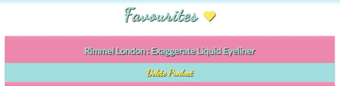
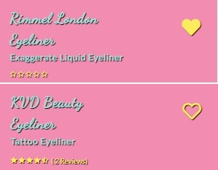
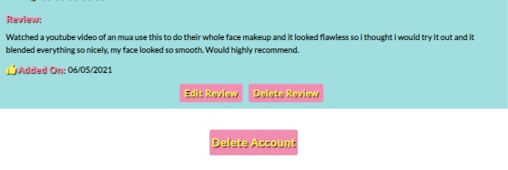
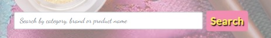

## **Testing**

### **Tests Carried Out**

### **Validation**
**HTML**
- I used the [W3C Markup Validator](https://validator.w3.org/)
- I tested all HTML pages by either url link or the 'view source code' link on Google DevTools
- When I first ran my code through the HTML validator, there were a few minor errors with buttons and anchor tags
- I resolved these minor issues and ran all page through the validator again.
- All HTML pages passed the validation

**CSS**
- I used the [W3C CSS Validation Service](https://jigsaw.w3.org/css-validator/)
- All CSS code passed the validation process with no errors

**Javascript**
- I used [JSHint](https://jshint.com/)
- When I ran the Javascript code through the validator all code passed with no errors

**Python**
- I used [pep8online](http://pep8online.com/) to validate my Python code
- All code passed and meets the PEP8 standards.

### **General**

Check alt text on images
Spellcheck on README
Autoprefixer CSS
Mobile Friendly Test
Testing on Physical devices

### **User Story Tests**

**_As a user I would like to understand the purpose of the website_**
- The homepage jumbotron callout provides a clear message of the website's purpose

**_As a user I want to be able to create my own profile that holds all my content_**
- Once a user signs up, they will be given a personalised profile page that displays their favourite products and the reviews they have created for the site.

**_As a user, I want to be able to navigate the website with ease._**
- The navigation bar is in a fixed position and always on display
- The navigation links are clearly defined and change depending on user status.
- Call to action buttons are defined and easy to identify
- Redirects and buttons are provided to take the user to the targeted area.

**_As a user, I would like the ability to edit and delete the content I create_**
- Users can edit their reviews by clicking the 'Edit Review' button located on the review card if the user is the creator of that review
- Users can delete their reviews by clicking on the 'Delete Review' button located on the review card, displayed if the user is the creator of that review.

**_As a user I want to access reviews posted by other users_**
- All product reviews are available to view by any user on the website. 
- The reviews can be found on the product info page, or  by clicking the 'More Reviews' button at the bottom of the product info page or the number of reviews link on the products page.

**_As a user, I want the ability to provide a rating for the product I am reviewing_**
- The reviews modals provided a rating field where users can give the product a rating from 1 - 5
- These options are displayed as radio buttons on the review modal forms.

**_As a user I would like to add my favourite products to my profile_**
- A clickable heart icon is located on the product card in both the products page and product info page.
- The heart icon displays as an outlined icon if the product is not in the user favourites list
- Users can click the icon and the product will be added to the users favourites list.

**_As a user, I want the ability to remove products I have added to my favourites list_**
- A clickable heart icon is located on the product card in both the products page and product info page.
- The heart icon displays as a full colour icon if the product has been added to the user's favourites list.
- Users can click the icon and the product will be added to the users favourites list.

**_As a user, I want the site to visually identify if a product has already been added to my list of favourite products._**
- Using a visual identifier, the heart icon displays as a icon outlined in yelloww if the product has not been added to the user favourites and displays as a full yellow colour if the product has already been added to the favourites list. 
- This allows registered users to clearly identify if a product is in their favourites list or not

**_As a user, I want to be able to delete my account_**
- A button located at the bottom of the user profile titled 'Delete Account' is provided so that users can delete their own account if they wish to do so.
- This button triggers a popup confirmation SweetAlert to ask the user to confirm the delete action
    to prevent any accidental deletes.

**_As a user, I want the ability to search for products by name, brand or category_**
- Users can search for products by category name, product name or product brand through the search bar functionality provided on the homepage, products page and product info page.
- It is clearly defined for users in the placeholder search bar text the ways in which they can search for products 
- Products can also be found using the categories links in the navigation bar dropdown menu.

**_As a user, I would like to add a review to any product available on the website_**
- Registered users have the ability to add a review to any product on the site through the 'Add Review' button located on the product card within the product info page.
- This triggers a popup modal form that the user can complete and submit in order to add their review.

**_As a user I would like the ability to be able to communicate with the website admin team._**
- Registered users can provide feedback to the admin team via a button 'Contact Us' located on the user profile.
- This button triggers a popup modal contact form where users can submit comments to the admin team.

**_As the owner and user, I want to provide a platform that encourages users to get involved and create content_**
- The website uses bright bold colours to attract the user and provides alot of user functionality(ability to control their own content, provide user feedback, add products to favourites list etc.)
which will peak the interest of users and encourage user involvement in the content creation 

**_As the owner and user, I want to provide users with relevant and current information_**
- Admin users can add, edit and delete categories and products. This allows them to ensure that the most up to date and relevant products are available on the website.
- Also access to user feedback is available through the Admin profile page located on the accordion menu to allow them to better understand the users needs.

**_As the owner and user, I want a website that is fun, vibrant and inviting._**
- The website uses a vibrant and fun colour scheme with plenty of vivid and attractive images

**_As the owner and user, I want to be able to add, update or delete products on the website_**
- Admin users can add, edit and delete products from the database.
- Buttons and links have been provided for admin view only 'Add Product', 'Edit Product' and 'Delete Product'
- 'Add Product' and 'Edit Product' can be accessed from the admin navigation menu dropdown list or from the Admin profile accordion menu under 'Manage'
- The 'Edit Product' and 'Delete Product' buttons can also be found on the products page.
- The 'Delete Product' button triggers a confirmation popup for the user to prevent accidental deletes.

**_As the owner, I want to be able to remove any reviews or users if necessary (e.g. inappropriate content)_**
- Admin users can access a list of all reviews from the database through the accordion menu on the Admin profile under 'Reviews'
- A 'Delete Review' button is provided on each review card which allow admin to delete any review.
- A popup confirmation is triggered to avoid any accidental deletes.

**_As the owner and user, I want the ability to create, update and delete categories_**
- Admin users can add, edit and delete categories from the database.
- Buttons and links have been provided for admin view only 'Add Category', 'Edit Category' and 'Delete Category'
- 'Add Category' and 'Edit Category' can be accessed from the admin navigation menu dropdown list or from the Admin profile accordion menu under 'Manage'
- The 'Edit Category' and 'Delete Category' buttons can also be found on the categories page.
- The 'Delete Category' button triggers a confirmation popup for the user to prevent accidental deletes.

**_As the owner and user, I want other users to be able to give feedback and provide suggestion of products they would like included on the website._**
- Registered users can provide user feedback through the 'Contact Us' button that triggers a modal popup from their profile page.
- Admin users can access all the user feedback from the database through the accordion menu on the Admin profile under 'Feedback & Suggestions'

**_As a guest user, I would like to be able to search for products and see the associated reviews without the ability to add/edit/delete reviews._**
- Guest users can browse the site for products using the categories dropdown menu on the navigation bar or using the search bar functionality on the homepage, products page or product info page.
- However, all buttons to add, edit or delete content are disabled and not visible to guest users.

## **Site Functionality**
### **Navigation Bar**

**_Navigation links_**

_All navigation links should take the user to the correct targeted section._
- The navigation links all work as intended and operate correctly.

_Navigation links should change depending on user status_
- The correct links are visible to Admin:
    - Home
    - Manage (Dropdown menu: Categories, Add Category, Products, Add Product)
    - Profile
    - Sign Out
- The correct links are visible to Registered Users:
    - Home
    - Categories (Dropdown menu: Eyes & Brows, Face, Lips, Tools & Accessories)
    - Profile
    - Sign Out
- The correct links are visible to guest users:
    - Home
    - Categories (Dropdown menu: Eyes & Brows, Face, Lips, Tools & Accessories)
    - Sign In
    - Register
- All intended links are showing up depending on user status

**_Navigation bar responsiveness_**

_Check responsiveness of navigation bar using Chrome DevTools to check if it worked across all devices._
- The navigation bar is fully responsive, it shows links to the right hand side on larger screens
and collapses into a hamburger menu on medium and smaller devices. This is working correctly and is responsive.

**_Navigation Logo link_**

_Check that navigation logo link directs user to homepage when clicked._
- The navigation logo link is functioning as expected  and when clicked, takes the user back to the homepage. This test was successful.

**_Navigation Links Hover Function: blue colour_**

_Check that when mouse hovers over navigation links the text changes to blue colour_
- When any of the navigation links on the navigation bar are hovered over with the mouse, they should change to a blue colour.
All buttons function as expected and no issues were found.

**_Hamburger menu closing after link has been selected._**

_Check that hamburger toggle menu automatically closes after a link has been selected_
- The hamburger menu toggles to show the three links provided and closes on selection of the chosen link. I had an issue with this on a previous project and had found the solution for this on 
[StackOverflow](https://stackoverflow.com/questions/36405991/bootstrap-toggle-menu-on-one-page-site-does-not-uncollapse-when-clicked),
which I used in this project to ensure the issue did not occur.

**_Category group links from dropdown menu work._**

_Check that the user is directed to the correct category group when a category group link is selected_
- All links take the user to the correct page 

**_Manage links from dropdown menu for Admin Users work._**

_Check that the all links in the dropdown 'Manage' menu work_
- All links take the user to the correct page 

#### **Homepage**
**_Homepage Hero Image Responsiveness_**

_Check that homepage background image is responsive and scales up and down depending on the device being used._
- I ran a test for this using DevTools on Google Chrome, to show how the site looks on different devices. I expanded and reduced the screen size to make sure the image fits the 
full width of the screen on all devices. The homepage hero image is fully responsive across all devices.

**_Callout_**

_Verify that callout is responsive and that text is displayed well on all devices._
- I ran a test using Google Chrome Dev Tools to ensure that the callout description and button were responsive and would scale up and down depending on the device being used.
The callout text is responsive and the text size changes slightly depending on the device being used. There were no issues found.

**_Search Bar Functionality_**

_Check that the search bar functions properly and directs the user to the products page related to their search_
- The search bar works as intended and directs the user to the products page with a list of products rellated to their search.
- It also returns a statement at the top of the search results indicating to the user the number of results found for their search.

**_Search Bar Input Field_**

_Check that the search bar input field will not function with an empty search field_
- I ran this test by trying attempting to use the search button with no search query input into the search field.
- The search function will not work with an empty field and the user is prompted to fill in the search input.
- This test was successful

**_Sign In Button_**

_Verify that sign in button works and directs the user to the sign in page._
- Button works and directs the user to the sign page where the user can sign into their account

**_Register Button_**

_Verify that register button works and directs the user to the register page._
- Button works and directs the user to the register page to create a new account

#### **Categories Page**
#### **Products Page**
#### **Product Info Page**
#### **Reviews Page**
#### **Profile Page**
#### **Admin Profile Page**
#### **Manage Users Page**
#### **User Feedback Page**
#### **Login Page**
#### **Register Page**
#### **Guest User**

### **Issues Encountered**
Contact form:
Go to the "Contact Us" page
Try to submit the empty form and verify that an error message about the required fields appears
Try to submit the form with an invalid email address and verify that a relevant error message appears
Try to submit the form with all inputs valid and verify that a success message appears.
In addition, you should mention in this section how your project looks and works on different browsers and screen sizes.

You should also mention in this section any interesting bugs or problems you discovered during your testing, even if you haven't addressed them yet.

If this section grows too long, you may want to split it off into a separate file and link to it from here.