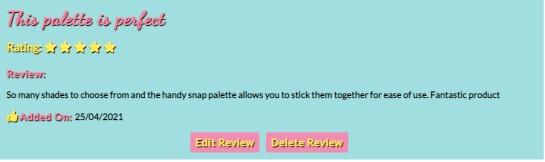
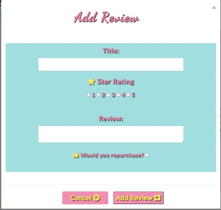
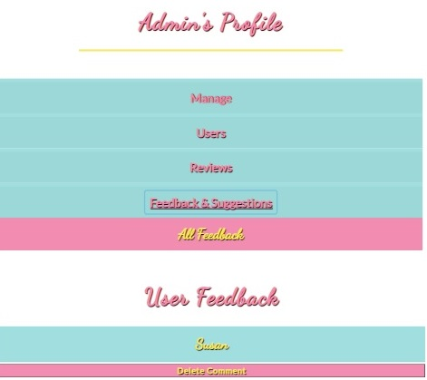

## **Testing**

### **Tests Carried Out**

### **Validation**
**HTML**
- I used the [W3C Markup Validator](https://validator.w3.org/)
- I tested all HTML pages by either url link or the 'view source code' link on Google DevTools
- When I first ran my code through the HTML validator, there were a few minor errors with buttons and anchor tags
- I resolved these minor issues and ran all page through the validator again.
- All HTML pages passed the validation

**CSS**
- I used the [W3C CSS Validation Service](https://jigsaw.w3.org/css-validator/)
- All CSS code passed the validation process with no errors

**Javascript**
- I used [JSHint](https://jshint.com/)
- When I ran the Javascript code through the validator all code passed with no errors

**Python**
- I used [pep8online](http://pep8online.com/) to validate my Python code
- All code passed and meets the PEP8 standards.

### **General**
**_Check alt text appears for all images_**

- Hover over images to see if there is clear alt text visible.
All images were tested and alt text appears on images.

**_Conducted spell check on README file and text used in both HTML files._**

- All spelling errors were corrected.

**_Autoprefixer CSS_**

- Ran code through Autoprefixer and copied code back into css file.

**_Mobile Friendly Test_**

- Ran code on [Mobile Friendly Test](https://search.google.com/test/mobile-friendly) page and passed all tests. The site is mobile friendly.

**_Testing on physical devices_**

- I also asked friends and family members to test the website on many different devices including large screen laptops,
iPhone, android, android table and iPad and across a variety of browsers Internet Explorer, Google Chrome, and Firefox

### **User Story Tests**

**_As a user I would like to understand the purpose of the website_**
- The homepage jumbotron callout provides a clear message of the website's purpose


**_As a user I want to be able to create my own profile that holds all my content_**
- Once a user signs up, they will be given a personalised profile page that displays their favourite products and the reviews they have created for the site.


**_As a user, I want to be able to navigate the website with ease._**
- The navigation bar is in a fixed position and always on display
- The navigation links are clearly defined and change depending on user status.
- Call to action buttons are defined and easy to identify
- Redirects and buttons are provided to take the user to the targeted area.

**_As a user, I would like the ability to edit and delete the content I create_**
- Users can edit their reviews by clicking the 'Edit Review' button located on the review card if the user is the creator of that review
- Users can delete their reviews by clicking on the 'Delete Review' button located on the review card, displayed if the user is the creator of that review.



**_As a user I want to access reviews posted by other users_**
- All product reviews are available to view by any user on the website. 
- The reviews can be found on the product info page, or  by clicking the 'More Reviews' button at the bottom of the product info page or the number of reviews link on the products page.

**_As a user, I want the ability to provide a rating for the product I am reviewing_**
- The reviews modals provided a rating field where users can give the product a rating from 1 - 5
- These options are displayed as radio buttons on the review modal forms.


**_As a user I would like to add my favourite products to my profile_**
- A clickable heart icon is located on the product card in both the products page and product info page.
- The heart icon displays as an outlined icon if the product is not in the user favourites list
- Users can click the icon and the product will be added to the users favourites list.


**_As a user, I want the ability to remove products I have added to my favourites list_**
- A clickable heart icon is located on the product card in both the products page and product info page.
- The heart icon displays as a full colour icon if the product has been added to the user's favourites list.
- Users can click the icon and the product will be added to the users favourites list.


**_As a user, I want the site to visually identify if a product has already been added to my list of favourite products._**
- Using a visual identifier, the heart icon displays as a icon outlined in yellow if the product has not been added to the user favourites and displays as a full yellow colour if the product has already been added to the favourites list. 
- This allows registered users to clearly identify if a product is in their favourites list or not


**_As a user, I want to be able to delete my account_**
- A button located at the bottom of the user profile titled 'Delete Account' is provided so that users can delete their own account if they wish to do so.
- This button triggers a popup confirmation SweetAlert to ask the user to confirm the delete action
    to prevent any accidental deletes.


**_As a user, I want the ability to search for products by name, brand or category_**
- Users can search for products by category name, product name or product brand through the search bar functionality provided on the homepage, products page and product info page.
- It is clearly defined for users in the placeholder search bar text the ways in which they can search for products 
- Products can also be found using the categories links in the navigation bar dropdown menu.


**_As a user, I would like to add a review to any product available on the website_**
- Registered users have the ability to add a review to any product on the site through the 'Add Review' button located on the product card within the product info page.
- This triggers a popup modal form that the user can complete and submit in order to add their review.




**_As a user I would like the ability to be able to communicate with the website admin team._**
- Registered users can provide feedback to the admin team via a button 'Contact Us' located on the user profile.
- This button triggers a popup modal contact form where users can submit comments to the admin team.


**_As the owner and user, I want to provide a platform that encourages users to get involved and create content_**
- The website uses bright colours to attract the user and provides alot of user functionality(ability to control their own content, provide user feedback, add products to favourites list etc.)
which will pique the interest of users and encourage user involvement in the content creation 

**_As the owner and user, I want to provide users with relevant and current information_**
- Admin users can add, edit and delete categories and products. This allows them to ensure that the most up to date and relevant products are available on the website.
- Also access to user feedback is available through the Admin profile page located on the accordion menu to allow them to better understand the users needs.

**_As the owner and user, I want a website that is fun, vibrant and inviting._**
- The website uses a vibrant and fun colour scheme with plenty of vivid and attractive images

**_As the owner and user, I want to be able to add, update or delete products on the website_**
- Admin users can add, edit and delete products from the database.
- Buttons and links have been provided for admin view only 'Add Product', 'Edit Product' and 'Delete Product'
- 'Add Product' and 'Edit Product' can be accessed from the admin navigation menu dropdown list or from the Admin profile accordion menu under 'Manage'
- The 'Edit Product' and 'Delete Product' buttons can also be found on the products page.
- The 'Delete Product' button triggers a confirmation popup for the user to prevent accidental deletes.


**_As the owner, I want to be able to remove any reviews or users if necessary (e.g. inappropriate content)_**
- Admin users can access a list of all reviews from the database through the accordion menu on the Admin profile under 'Reviews'
- A 'Delete Review' button is provided on each review card which allow admin to delete any review.
- A popup confirmation is triggered to avoid any accidental deletes.


**_As the owner and user, I want the ability to create, update and delete categories_**
- Admin users can add, edit and delete categories from the database.
- Buttons and links have been provided for admin view only 'Add Category', 'Edit Category' and 'Delete Category'
- 'Add Category' and 'Edit Category' can be accessed from the admin navigation menu dropdown list or from the Admin profile accordion menu under 'Manage'
- The 'Edit Category' and 'Delete Category' buttons can also be found on the categories page.
- The 'Delete Category' button triggers a confirmation popup for the user to prevent accidental deletes.


**_As the owner and user, I want other users to be able to give feedback and provide suggestion of products they would like included on the website._**
- Registered users can provide user feedback through the 'Contact Us' button that triggers a modal popup from their profile page.
- Admin users can access all the user feedback from the database through the accordion menu on the Admin profile under 'Feedback & Suggestions'



**_As a guest user, I would like to be able to search for products and see the associated reviews without the ability to add/edit/delete reviews._**
- Guest users can browse the site for products using the categories dropdown menu on the navigation bar or using the search bar functionality on the homepage, products page or product info page.
- However, all buttons to add, edit or delete content are disabled and not visible to guest users.

## **Site Functionality**
### **Navigation Bar**

**_Navigation links_**

**_All navigation links should take the user to the correct targeted section._**
- The navigation links all work as intended and operate correctly.

_Navigation links should change depending on user status_
- The correct links are visible to Admin:
    - Home
    - Manage (Dropdown menu: Categories, Add Category, Products, Add Product)
    - Profile
    - Sign Out
- The correct links are visible to Registered Users:
    - Home
    - Categories (Dropdown menu: Eyes & Brows, Face, Lips, Tools & Accessories)
    - Profile
    - Sign Out
- The correct links are visible to guest users:
    - Home
    - Categories (Dropdown menu: Eyes & Brows, Face, Lips, Tools & Accessories)
    - Sign In
    - Register
- All intended links are showing up depending on user status

**_Navigation bar responsiveness_**

**_Check responsiveness of navigation bar using Chrome DevTools to check if it worked across all devices._**
- The navigation bar is fully responsive, it shows links to the right hand side on larger screens
and collapses into a hamburger menu on medium and smaller devices. This is working correctly and is responsive.

**_Navigation Logo link_**

**_Check that navigation logo link directs user to homepage when clicked._**
- The navigation logo link is functioning as expected  and when clicked, takes the user back to the homepage. This test was successful.

**_Navigation Links Hover Function: turquoise colour_**

**_Check that when mouse hovers over navigation links the text changes to turquoise colour_**
- When any of the navigation links on the navigation bar are hovered over with the mouse, they should change to a turquoise colour.
All buttons function as expected and no issues were found.

**_Hamburger menu closing after link has been selected._**

**_Check that hamburger toggle menu automatically closes after a link has been selected_**
- The hamburger menu toggles to show the three links provided and closes on selection of the chosen link. I had an issue with this on a previous project and had found the solution for this on 
[StackOverflow](https://stackoverflow.com/questions/36405991/bootstrap-toggle-menu-on-one-page-site-does-not-uncollapse-when-clicked),
which I used in this project to ensure the issue did not occur.

**_Category group links from dropdown menu work._**

**_Check that the user is directed to the correct category group when a category group link is selected_**
- All links take the user to the correct page 

**_Manage links from dropdown menu for Admin Users work._**

**_Check that the all links in the dropdown 'Manage' menu work_**
- All links take the user to the correct page 


#### **Homepage**
**_Homepage Hero Image Responsiveness_**

**_Check that homepage background image is responsive and scales up and down depending on the device being used._**
- I ran a test for this using DevTools on Google Chrome, to show how the site looks on different devices. I expanded and reduced the screen size to make sure the image fits the 
full width of the screen on all devices. The homepage hero image is fully responsive across all devices.

**_Callout_**

**_Verify that callout is responsive and that text is displayed well on all devices._**
- I ran a test using Google Chrome Dev Tools to ensure that the callout description and button were responsive and would scale up and down depending on the device being used.
The callout text is responsive and the text size changes slightly depending on the device being used. There were no issues found.

**_Search Bar Functionality_**

**_Check that the search bar functions properly and directs the user to the products page related to their search_**
- The search bar works as intended and directs the user to the products page with a list of products related to their search.
- It also returns a statement at the top of the search results indicating to the user the number of results found for their search.

**_Search Bar Input Field_**

**_Check that the search bar input field will not function with an empty search field_**
- I ran this test by trying attempting to use the search button with no search query input into the search field.
- The search function will not work with an empty field and the user is prompted to fill in the search input.
- This test was successful

**_Search Bar_**

**_Check that the search bar will allow the user to search by product name, brand or category and return the correct results_**
- I ran this test by trying attempting to search by product name, brand and category using the search bar on the homepage
- The search function worked as expected and returned the correct products, users can search by product name, brand or category.
- This test was successful

**_Sign In Button_**

**_Verify that sign in button works and directs the user to the sign in page._**
- Button works and directs the user to the sign page where the user can sign into their account

**_Register Button_**

**_Verify that register button works and directs the user to the register page._**
- Button works and directs the user to the register page to create a new account


#### **Categories Page**
**_Category card display responsiveness_**

**_Check responsiveness of category cards using Chrome DevTools to check if it worked across all devices._**
- I ran a test for this using DevTools on Google Chrome, to show how the category cards look on different devices. I expanded and reduced the screen size to make sure the image fits the 
full width of the screen on all devices. The category cards are fully responsive across all devices.

**_Hidden search input functionality on category cards_**

**_Check that the search function on the category card directs the user to a list of products within that category_**
- I ran a test by clicking the search icon on each category card to check if the user is directed to the correct products.
- This test was successful and the user is directed to the correct list of products within each category.

**_'Edit Category' & 'Delete Category' buttons_**

**_Check that the 'Edit Category' and 'Delete Category' buttons are only visible when signed in as Admin._**
- I ran a test by signing in as an Admin user and the button were displayed on each card as expected.
- I then signed in as a registered user and the buttons were no longer visible on the category cards.
- I also tested this as a guest user and the buttons are not visible to a guest user.
- This test was successful.

**_'Edit Category' button functionality_**

**_Check that the 'Edit Category' button directs the admin user to the edit category page._**
- I ran a test by clicking on the edit category button as an Admin user.
- I was directed to the Edit category page as expected
- This test was successful.

**_'Delete Category' button functionality_**

**_Check that the 'Delete Category' button triggers the SweetAlert confirmation popup._**
- I ran a test by clicking on the delete category button as an Admin user.
- The Sweet Alert popup was triggered and asked me to confirm if I wanted to delete that category.
- This test was successful.

**_'Delete Category' SweetAlert cancel functionality_**

**_Check that the cancel button on the 'Delete Category' SweetAlert confirmation popup works._**
- I ran a test by clicking on the delete category button as an Admin user.
- The Sweet Alert popup was triggered and asked me to confirm if I wanted to delete that category.
- I then clicked cancel and remained on the categories page, the category was **NOT** deleted and the popup disappeared.
- This test was successful.

**_'Delete Category' SweetAlert confirm functionality_**

**_Check that the confirm button on the 'Delete Category' SweetAlert confirmation popup successfully deletes a category._**
- I ran a test by clicking on the delete category button as an Admin user.
- The Sweet Alert popup was triggered and asked me to confirm if I wanted to delete that category.
- I then clicked 'Yes, Delete' button and the category selected was deleted.
- An alert is shown to the user via flash message to inform them the category has been deleted.
- I checked that this category had been deleted from the Mongodb database and it had.
- This test was successful.


#### **Add Category Page**

**_Add Category form responsiveness_**

**_Check responsiveness of add category form using Chrome DevTools to check if it worked across all devices._**
- I ran a test for this using DevTools on Google Chrome, to show how the add category form looks on different devices. I expanded and reduced the screen size to make sure the image fits the 
full width of the screen on all devices. The add category form is fully responsive across all devices.

**_Add Category Form Validity - required fields_**

**_Check that the user is alerted if input fields are not filled in._**
- If you try to submit the form without all of the fields complete, an error will occur
and prompt you to populate all the other required fields before the user can submit the form.

**_'Cancel' button functionality_**

**_Check that the 'Cancel' button redirects the admin user back to the the 'Categories Page'._**
- I ran a test by clicking on the cancel button on the form.
- I was redirected back to the Categories page as expected
- This test was successful.

**_'Add Category' button functionality_**

**_Check that the 'Add Category' button works and adds a category to the database._**
- I ran a test by completing the add category form.
- I then clicked the Add Category button on the form
- The category was added to the database and the user is alerted via flash message that 'New Category Added'
- I checked that this category had been added to the Mongodb database and it had.
- This test was successful.


#### **Edit Category Page**

**_Edit Category form responsiveness_**

**_Check responsiveness of edit category form using Chrome DevTools to check if it worked across all devices._**
- I ran a test for this using DevTools on Google Chrome, to show how the edit category form looks on different devices. I expanded and reduced the screen size to make sure the image fits the 
full width of the screen on all devices. The edit category form is fully responsive across all devices.

**_Edit Category Form Input Fields_**

**_Check that the form is pre-populated with the category information to be updated._**
- The form pre-populates the correct corresponding category information already on the database for that category with the exception of the dropdown list of category groups which have to be selected by the user editing the category.
- This test was successful

**_Edit Category Form Validity - required fields_**

**_Check that the user is alerted if the empty input fields are not filled in._**
- If you try to submit the form without all of the fields complete, an error will occur
and prompt you to populate all the other required fields before the user can submit the form.

**_'Cancel' button functionality_**

**_Check that the 'Cancel' button redirects the admin user back to the the 'Categories Page'._**
- I ran a test by clicking on the cancel button on the form.
- I was redirected back to the Categories page as expected
- This test was successful.

**_'Edit Category' button functionality_**

**_Check that the 'Edit Category' button works and the category is updated in the database._**
- I ran a test by completing the edit category form.
- I then clicked the Edit Category button on the form
- The category was updated in the database and the user is alerted via flash message that 'Category Successfully Updated'
- I checked that this category had been updated in the Mongodb database and it had.
- This test was successful.


#### **Products Page**
**_Product card display responsiveness_**

**_Check responsiveness of product card using Chrome DevTools to check if it worked across all devices._**
- I ran a test for this using DevTools on Google Chrome, to show how the product cards look on different devices. I expanded and reduced the screen size to make sure the image fits the 
full width of the screen on all devices. The product cards are fully responsive across all devices.
- Product cards are displayed with image to the left and product information to the right on larger screens
- Product cards are displayed with image on top and product information underneath on smaller devices.

**_Favourites Heart Icon button_**

**_Check that the favourites heart icon button are only visible when signed in as a registered user._**
- I ran a test by signing in as registered user and the heart icon was visible on the product card.
- I also tested this as a guest user and the heart icon button is not visible to a guest user.
- This test was successful.

**_Favourites Heart Icon button functionality_**

**_Check that the favourites heart icon(when only showing outline yellow) button works and when clicked adds a product to the user favourites._**
- I ran a test by signing in as registered user and clicking the outlined yellow icon of a product.
- The button when clicked adds the product to the users favourites list
- It alerts the user via flash message that 'Product added to favourites'
- This test was successful.

**_Favourites Heart Icon button functionality_**

**_Check that the favourites heart icon button works(when showing full yellow colour) and when clicked removes a product from the user favourites._**
- I ran a test by signing in as registered user and clicking the full yellow coloured icon of a product I had added to the favourites list
- The button when clicked removes the product from the users favourites list
- It alerts the user via flash message that 'Product removed from favourites'
- This test was successful.

**_Favourites Heart Icon button toggle outline_**

**_Check that the favourites heart icon button features only a heart with yellow outline if product is not in user favourites._**
- I ran a test by signing in as registered user and locating an item not in my favourites list
- The icon was outlined in yellow indicating the product was not in my favourites list
- This test was successful.

**_Favourites Heart Icon button toggle full colour_**

**_Check that the favourites heart icon button features a full yellow coloured icon if product is in user favourites._**
- I ran a test by signing in as registered user and locating an item that was added to my favourites list
- The icon was displaying as a full yellow coloured heart indicating that the product was already in my favourites list.
- This test was successful.

**_Average Star Product Rating_**

**_Check that the correct average star product rating is displayed on the product card._**
- I ran a test by checking the review ratings on some products, calculating the average and checking it against the stars shown on the product card.
- The correct average rating is displayed on all product cards.
- This test was successful.

**_Number of Reviews Link Functionality_**

**_Check that the number of reviews link, when clicked directs the user to the product reviews related to that product._**
- I ran a test by clicking on the number of reviews link on the product card.
- The link takes the user to the reviews page displaying all related product reviews for that specific product.
- This test was successful.

**_'More Info' button functionality_**

**_Check that the 'More Info' button directs the user to the product info page for that specific product._**
- I ran a test by clicking on the more info button.
- I was directed to the product info page for that specific product as expected
- This test was successful.

**_'Edit Product' & 'Delete Product' buttons_**

**_Check that the 'Edit Product' and 'Delete Product' buttons are only visible when signed in as Admin._**
- I ran a test by signing in as an Admin user and the button were displayed on each card as expected.
- I then signed in as a registered user and the buttons were no longer visible on the category cards.
- I also tested this as a guest user and the buttons are not visible to a guest user.
- This test was successful.

**_'Edit Product' button functionality_**

**_Check that the 'Edit Product' button directs the admin user to the edit product page._**
- I ran a test by clicking on the edit product button as an Admin user.
- I was directed to the Edit product page as expected
- This test was successful.

**_'Delete Product' button functionality_**

**_Check that the 'Delete Product' button triggers the SweetAlert confirmation popup._**
- I ran a test by clicking on the delete product button as an Admin user.
- The Sweet Alert popup was triggered and asked me to confirm if I wanted to delete that product.
- This test was successful.

**_'Delete Product' SweetAlert cancel functionality_**

**_Check that the cancel button on the 'Delete Product' SweetAlert confirmation popup works._**
- I ran a test by clicking on the delete product button as an Admin user.
- The Sweet Alert popup was triggered and asked me to confirm if I wanted to delete that product.
- I then clicked cancel and remained on the products page, the product was **NOT** deleted and the popup disappeared.
- This test was successful.

**_'Delete Product' SweetAlert confirm functionality_**

**_Check that the confirm button on the 'Delete Product' SweetAlert confirmation popup successfully deletes a product._**
- I ran a test by clicking on the delete product button as an Admin user.
- The Sweet Alert popup was triggered and asked me to confirm if I wanted to delete that product.
- I then clicked 'Yes, Delete' button and the product selected was deleted.
- An alert is shown to the user via flash message to inform them the product has been deleted.
- I checked that this product had been deleted from the Mongodb database and it had.
- This test was successful.


#### **Add Product Page**

**_Add Product form responsiveness_**

**_Check responsiveness of add product form using Chrome DevTools to check if it worked across all devices._**
- I ran a test for this using DevTools on Google Chrome, to show how the add product form looks on different devices. I expanded and reduced the screen size to make sure the image fits the 
full width of the screen on all devices. The add product form is fully responsive across all devices.

**_Add Product Form Validity - required fields_**

**_Check that the user is alerted if input fields are not filled in._**
- If you try to submit the form without all of the fields complete, an error will occur
and prompt you to populate all the other required fields before the user can submit the form.

**_'Cancel' button functionality_**

**_Check that the 'Cancel' button redirects the admin user back to the the 'Products Page'._**
- I ran a test by clicking on the cancel button on the form.
- I was redirected back to the Products page as expected
- This test was successful.

**_'Add Product' button functionality_**

**_Check that the 'Add Product' button works and adds a product to the database._**
- I ran a test by completing the add product form.
- I then clicked the Add Product button on the form
- The product was added to the database and the user is alerted via flash message that 'New Product Added'
- I checked that this product had been added to the Mongodb database and it had.
- This test was successful.


#### **Edit Product Page**

**_Edit Product form responsiveness_**

**_Check responsiveness of edit product form using Chrome DevTools to check if it worked across all devices._**
- I ran a test for this using DevTools on Google Chrome, to show how the edit product form looks on different devices. I expanded and reduced the screen size to make sure the image fits the 
full width of the screen on all devices. The edit product form is fully responsive across all devices.

**_Edit Product Form Input Fields_**

**_Check that the form is pre-populated with the product information to be updated._**
- The form pre-populates the correct corresponding product information already on the database for that product with the exception of the dropdown list of category names which have to be selected by the user editing the product.
- This test was successful

**_Edit Product Form Validity - required fields_**

**_Check that the user is alerted if the empty input fields are not filled in._**
- If you try to submit the form without all of the fields complete, an error will occur
and prompt you to populate all the other required fields before the user can submit the form.

**_'Cancel' button functionality_**

**_Check that the 'Cancel' button redirects the admin user back to the the 'Products Page'._**
- I ran a test by clicking on the cancel button on the form.
- I was redirected back to the Products page as expected
- This test was successful.

**_'Edit Product' button functionality_**

**_Check that the 'Edit Product' button works and the product is updated in the database._**
- I ran a test by completing the edit product form.
- I then clicked the Edit Product button on the form
- The product was updated in the database and the user is alerted via flash message that 'Product Successfully Updated'
- I checked that this product had been updated in the Mongodb database and it had.
- This test was successful.


#### **Product Info Page**
**_Product card display responsiveness_**

**_Check responsiveness of product card using Chrome DevTools to check if it worked across all devices._**
- I ran a test for this using DevTools on Google Chrome, to show how the product card looks on different devices. I expanded and reduced the screen size to make sure the image fits the 
full width of the screen on all devices. The product card is fully responsive across all devices.

**_Favourites Heart Icon button_**

**_Check that the favourites heart icon button is only visible when signed in as a registered user._**
- I ran a test by signing in as registered user and the heart icon was visible on the product card.
- I also tested this as a guest user and the heart icon button is not visible to a guest user.
- This test was successful.

**_Favourites Heart Icon button functionality_**

**_Check that the favourites heart icon(when only showing outline yellow) button works and when clicked adds a product to the user favourites._**
- I ran a test by signing in as registered user and clicking the outlined yellow icon of a product.
- The button when clicked adds the product to the users favourites list
- It alerts the user via flash message that 'Product added to favourites'
- This test was successful.

**_Favourites Heart Icon button functionality_**

**_Check that the favourites heart icon button works(when showing full yellow colour) and when clicked removes a product from the user favourites._**
- I ran a test by signing in as registered user and clicking the full yellow coloured icon of a product I had added to the favourites list
- The button when clicked removes the product from the users favourites list
- It alerts the user via flash message that 'Product removed from favourites'
- This test was successful.

**_Favourites Heart Icon button toggle outline_**

**_Check that the favourites heart icon button features only a heart with yellow outline if product is not in user favourites._**
- I ran a test by signing in as registered user and locating an item not in my favourites list
- The icon was outlined in yellow indicating the product was not in my favourites list
- This test was successful.

**_Favourites Heart Icon button toggle full colour_**

**_Check that the favourites heart icon button features a full yellow coloured icon if product is in user favourites._**
- I ran a test by signing in as registered user and locating an item that was added to my favourites list
- The icon was displaying as a full yellow coloured heart indicating that the product was already in my favourites list.
- This test was successful.

**_Average Star Product Rating_**

**_Check that the correct average star product rating is displayed on the product card._**
- I ran a test by checking the review ratings from the related product reviews, calculating the average and checking it against the stars shown on the product card.
- The correct average rating is displayed on the product card.
- This test was successful.

**_Add Review button_**

**_Check that the Add Review button is only visible when signed in as a registered user._**
- I ran a test by signing in as registered user and the 'Add Review' button was visible on the product card.
- I also tested this as a guest user and the 'Add Review' button is not visible to a guest user.
- This test was successful.

**_'Add Review' button functionality_**

**_Check that the 'Add Review' button works and triggers the add review popup modal form._**
- I ran a test by clicking the add review button
- A popup modal form 'Add Review' was triggered for a user to fill in to add a review.
- This test was successful.

**_'Add Review' modal responsiveness_**

**_Check responsiveness of 'Add Review' modal using Chrome DevTools to check if it worked across all devices._**
- I ran a test for this using DevTools on Google Chrome, to show how the Add Review modal looks on different devices. I expanded and reduced the screen size to make sure the image fits the 
full width of the screen on all devices. The add review modal is fully responsive across all devices.

**_Add Review Modal Form Validity - required fields_**

**_Check that the user is alerted if the empty input fields are not filled in._**
- If you try to submit the form without all of the fields complete, an error will occur
and prompt you to populate all the other required fields before the user can submit the form.

**_'Cancel' modal form button functionality_**

**_Check that the 'Cancel' button redirects the user back to the the 'Product Info Page'._**
- I ran a test by clicking on the cancel button on the form.
- I was redirected back to the Product Info page as expected
- This test was successful.

**_'Add Review' modal form button functionality_**

**_Check that the 'Add Review' button works and the review is added to the database._**
- I ran a test by completing the add review modal form.
- I then clicked the Add Review button on the form
- The review was successfully added in the database and the user is alerted via flash message that 'New Review Added'
- I checked that this review had been added to the Mongodb database and it had.
- This test was successful.

**_Review card display responsiveness_**

**_Check responsiveness of review cards using Chrome DevTools to check if it worked across all devices._**
- I ran a test for this using DevTools on Google Chrome, to show how the review cards look on different devices. I expanded and reduced the screen size to make sure the image fits the 
full width of the screen on all devices. The review cards are fully responsive across all devices.

**_Review card - correct related reviews displayed_**

**_Check that the correct reviews related to that specific product is displayed on product info page._**
- I ran a test for this by checking that the reviews displayed were related to the product.
- This test was a success and only reviews for the specific product are displayed.

**_Review card - most recent 5 reviews displayed_**

**_Check that max five reviews for products is displayed on product info page._**
- I ran a test for this by adding more than 5 reviews to one product and checking the product info page
- This test was a success and only the most recent 5 related product reviews are displayed on the product info page

**_'More Reviews' button functionality_**

**_Check that the 'More Info' button directs the user to the reviews page for that specific product._**
- I ran a test by clicking on the more reviews button.
- I was directed to the reviews page
- The reviews displayed were all the correct reviews related to that specific product.
- This test was successful.


#### **Reviews Page**
**_Review card display responsiveness_**

**_Check responsiveness of review cards using Chrome DevTools to check if it worked across all devices._**
- I ran a test for this using DevTools on Google Chrome, to show how the review cards look on different devices. I expanded and reduced the screen size to make sure the image fits the 
full width of the screen on all devices. The review cards are fully responsive across all devices.

**_Review cards - correct reviews displayed_**

**_Check that the correct reviews for the corresponding product are displayed._**
- The reviews displayed were all the correct reviews related to that specific product.
- This test was successful.

**_Review cards - all reviews displayed(Admin only)_**

**_Check that the all reviews are displayed when Admin navigates to Reviews page from Admin profile link - All Reviews'._**
- I ran this test by signing in as Admin, navigating to the Admin profile, clicking on the 'All Reviews' link.
- The link directed me to the reviews page and displayed all reviews from the database as expected.
- This test was successful.

**_'Edit Review' button_**

**_Check that the 'Edit Review' button is only visible when the user has created the review._**
- I ran a test by signing in as a registered user and navigating to the reviews page.
- The button was only visible on the reviews I created.
- I then signed in as an Admin user and the button was no longer visible on the review cards
- I also tested this as a guest user and the button is not visible to a guest user.
- This test was successful.

**_'Delete Review' button_**
**_Check that the 'Delete Review' button is only visible when the user has created the review or Admin._**
- I ran a test by signing in as an Admin user and the button was displayed on each card as expected.
- I then signed in as a registered user and the buttons was only visible on the cards of the reviews I created
- I also tested this as a guest user and the button is not visible to a guest user.
- This test was successful.

**_'Edit Review' button functionality_**

**_Check that the 'Edit Review' button works and triggers the edit review popup modal form._**
- I ran a test by clicking the edit review button
- A popup modal form 'Edit Review' was triggered for a user to update and edit the review.
- This test was successful.

**_'Edit Review' modal responsiveness_**

**_Check responsiveness of 'Edit Review' modal using Chrome DevTools to check if it worked across all devices._**
- I ran a test for this using DevTools on Google Chrome, to show how the Edit Review modal looks on different devices. I expanded and reduced the screen size to make sure the image fits the 
full width of the screen on all devices. The edit review modal is fully responsive across all devices.

**_Edit Review Modal Form Validity - required fields_**

**_Check that the user is alerted if the empty input fields are not filled in._**
- If you try to submit the form without all of the fields complete, an error will occur
and prompt you to populate all the other required fields before the user can submit the form.

**_Edit Review Form Input Fields_**

**_Check that the form is pre-populated with the review information to be updated._**
- The form pre-populates the correct corresponding review information already on the database for that review with the exception of the product rating which has to be selected by the user again when editing the review.
- This test was successful

**_'Cancel' modal form button functionality_**

**_Check that the 'Cancel' button redirects the user back to the the 'Reviews Page'._**
- I ran a test by clicking on the cancel button on the form.
- I was redirected back to the Reviews page as expected
- This test was successful.

**_'Edit Review' modal form button functionality_**

**_Check that the 'Edit Review' button works and the review is updated on the database._**
- I ran a test by completing the edit review modal form.
- I then clicked the Edit Review button on the form
- The review was successfully updated on the database and the user is alerted via flash message that 'Review Succesfully Updated'
- I checked that this review had been updated in the Mongodb database and it had.
- This test was successful.

**_'Delete Review' button functionality_**

**_Check that the 'Delete Review' button triggers the SweetAlert confirmation popup._**
- I ran a test by clicking on the delete review button as the registered user that created the review.
- The Sweet Alert popup was triggered and asked me to confirm if I wanted to delete that review.
- This test was successful.

**_'Delete Review' SweetAlert cancel functionality_**

**_Check that the cancel button on the 'Delete Review' SweetAlert confirmation popup works._**
- I ran a test by clicking on the delete review button as the registered user that created the review.
- The Sweet Alert popup was triggered and asked me to confirm if I wanted to delete that review.
- I then clicked cancel and remained on the reviews page, the review was **NOT** deleted and the popup disappeared.
- This test was successful.

**_'Delete Review' SweetAlert confirm functionality_**

**_Check that the confirm button on the 'Delete Review' SweetAlert confirmation popup successfully deletes a review._**
- I ran a test by clicking on the delete review button as the registered user that created the review.
- The Sweet Alert popup was triggered and asked me to confirm if I wanted to delete that review.
- I then clicked 'Yes, Delete' button and the review selected was deleted.
- An alert is shown to the user via flash message to inform them the review has been deleted.
- I checked that this review had been deleted from the Mongodb database and it had.
- This test was successful.

**_'Back to Product' button functionality(registered users and guest users)_**

**_Check that the 'Back to Product' button redirects the user back to the product info page._**
- I ran a test by signing in as a registered user and a guest user and clicking on the back to product button from the reviews page.
- I was redirected back to the product info page as expected.
- This test was successful.

**_'Back to Profile' button functionality(Admin only)_**

**_Check that the 'Back to Profile' button redirects the user back to the Admin profile page._**
- I ran a test by signing in as Admin and navigating to the all reviews page and clicking the 'Back to Profile' button.
- I was redirected back to the Admin profile page as expected.
- This test was successful.


#### **Profile Page**
**_Favourites Accordion responsiveness_**

**_Check responsiveness of favourites accordion using Chrome DevTools to check if it worked across all devices._**
- I ran a test for this using DevTools on Google Chrome, to show how the favourites accordion looks on different devices. I expanded and reduced the screen size to make sure the image fits the 
full width of the screen on all devices. The favourites accordion is fully responsive across all devices.

**_'Delete Favourite' button functionality_**

**_Check that the 'Delete Favourites' button removes product from user favourites list._**
- I ran a test by clicking on the delete product button on the favourites accordion list on the profile page.
- The product was removed from the favourites list and an alert via flash message was displayed 'Product removed from Favourites'.
- This test was successful.

**_'Edit Review' button functionality_**

**_Check that the 'Edit Review' button works and triggers the edit review popup modal form._**
- I ran a test by clicking the edit review button
- A popup modal form 'Edit Review' was triggered for a user to update and edit the review.
- This test was successful.

**_'Contact Us' modal responsiveness_**

**_Check responsiveness of 'Contact Us' modal using Chrome DevTools to check if it worked across all devices._**
- I ran a test for this using DevTools on Google Chrome, to show how the Contact Us modal looks on different devices. I expanded and reduced the screen size to make sure the image fits the 
full width of the screen on all devices. The contact us modal is fully responsive across all devices.

**_Edit Review Modal Form Validity - required fields_**

**_Check that the user is alerted if the empty input fields are not filled in._**
- If you try to submit the form without all of the fields complete, an error will occur
and prompt you to populate all the other required fields before the user can submit the form.

**_'Cancel' modal form button functionality_**

**_Check that the 'Cancel' button redirects the user back to the the Profile page._**
- I ran a test by clicking on the cancel button on the form.
- It closes the contact us modal.
- This test was successful.

**_'Contact Us' modal form button functionality_**

**_Check that the 'Send Message' button works and the feedback is added to the database._**
- I ran a test by completing the contact us modal form.
- I then clicked the Send Message button on the form
- The feedback was successfully added to the database and the user is alerted via flash message that 'Your message has been sent'
- I checked that the user feedback had been added to the Mongodb database and it had.
- This test was successful.

**_Review card display responsiveness_**

**_Check responsiveness of user review cards using Chrome DevTools to check if it worked across all devices._**
- I ran a test for this using DevTools on Google Chrome, to show how the user review cards look on different devices. I expanded and reduced the screen size to make sure the image fits the 
full width of the screen on all devices. The user review cards are fully responsive across all devices.

**_Review cards - correct reviews displayed_**

**_Check that the correct reviews for the corresponding user are displayed._**
- The reviews displayed were all the correct reviews created by the user.
- This test was successful.

**_'Edit Review' button functionality_**

**_Check that the 'Edit Review' button works and triggers the edit review popup modal form._**
- I ran a test by clicking the edit review button
- A popup modal form 'Edit Review' was triggered for a user to update and edit the review.
- This test was successful.

**_'Edit Review' modal responsiveness_**

**_Check responsiveness of 'Edit Review' modal using Chrome DevTools to check if it worked across all devices._**
- I ran a test for this using DevTools on Google Chrome, to show how the Edit Review modal looks on different devices. I expanded and reduced the screen size to make sure the image fits the 
full width of the screen on all devices. The edit review modal is fully responsive across all devices.

**_Edit Review Modal Form Validity - required fields_**

**_Check that the user is alerted if the empty input fields are not filled in._**
- If you try to submit the form without all of the fields complete, an error will occur
and prompt you to populate all the other required fields before the user can submit the form.

**_Edit Review Form Input Fields_**

**_Check that the form is pre-populated with the review information to be updated._**
- The form pre-populates the correct corresponding review information already on the database for that review with the exception of the product rating which has to be selected by the user again when editing the review.
- This test was successful

**_'Cancel' modal form button functionality_**

**_Check that the 'Cancel' button redirects the user back to the the Profile page._**
- I ran a test by clicking on the cancel button on the form.
- I was redirected back to the Profile page as expected
- This test was successful.

**_'Edit Review' modal form button functionality_**

**_Check that the 'Edit Review' button works and the review is updated on the database._**
- I ran a test by completing the edit review modal form.
- I then clicked the Edit Review button on the form
- The review was successfully updated on the database and the user is alerted via flash message that 'Review Succesfully Updated'
- I checked that this review had been updated in the Mongodb database and it had.
- This test was successful.

**_'Delete Review' button functionality_**

**_Check that the 'Delete Review' button triggers the SweetAlert confirmation popup._**
- I ran a test by clicking on the delete review button as the registered user.
- The Sweet Alert popup was triggered and asked me to confirm if I wanted to delete that review.
- This test was successful.

**_'Delete Review' SweetAlert cancel functionality_**

**_Check that the cancel button on the 'Delete Review' SweetAlert confirmation popup works._**
- I ran a test by clicking on the delete review button as the registered user.
- The Sweet Alert popup was triggered and asked me to confirm if I wanted to delete that review.
- I then clicked cancel and remained on the reviews page, the review was **NOT** deleted and the popup disappeared.
- This test was successful.

**_'Delete Review' SweetAlert confirm functionality_**

**_Check that the confirm button on the 'Delete Review' SweetAlert confirmation popup successfully deletes a review._**
- I ran a test by clicking on the delete review button as the registered user.
- The Sweet Alert popup was triggered and asked me to confirm if I wanted to delete that review.
- I then clicked 'Yes, Delete' button and the review selected was deleted.
- An alert is shown to the user via flash message to inform them the review has been deleted.
- I checked that this review had been deleted from the Mongodb database and it had.
- This test was successful.

**_'Delete Account' button functionality_**

_Check that the 'Delete Account' button triggers the SweetAlert confirmation popup._
- I ran a test by clicking on the delete account button at the bottom of the profile page
- The Sweet Alert popup was triggered and asked me to confirm if I wanted to delete my account.
- This test was successful.

**_'Delete Account' SweetAlert cancel functionality_**

_Check that the cancel button on the 'Delete Account' SweetAlert confirmation popup works._
- I ran a test by clicking on the delete account button at the bottom of the profile page.
- The Sweet Alert popup was triggered and asked me to confirm if I wanted to delete my account.
- I then clicked cancel and remained on the profile page, the account was **NOT** deleted and the popup disappeared.
- This test was successful.

**_'Delete Account' SweetAlert confirm functionality_**

_Check that the confirm button on the 'Delete Account' SweetAlert confirmation popup successfully deletes the user account._
- I ran a test by clicking on the delete account button at the bottom of the profile page.
- The Sweet Alert popup was triggered and asked me to confirm if I wanted to delete my account.
- I then clicked 'Yes, Delete' button and the account selected was deleted.
- An alert is shown to the user via flash message to inform them the account has been deleted.
- The user is redirected back to the home page
- I checked if the user account had been deleted from the Mongodb database and it had.
- This test was successful.


#### **Admin Profile Page**
**_Admin Profile Accordion List Responsiveness_**

_Check responsiveness of admin profile accordion list using Chrome DevTools to check if it worked across all devices._
- I ran a test for this using DevTools on Google Chrome, to show how the admin profile accordion list looks on different devices. I expanded and reduced the screen size to make sure the image fits the 
full width of the screen on all devices. The admin profile accordion list is fully responsive across all devices.

**_'All Categories' link functionality_**

**_Check that the 'All Categories' link works and directs the user to the categories page._**
- I ran a test by signing in as an Admin user and navigating to the Admin profile page.
- I clicked on the All Categories link in Manage section of the accordion menu.
- The link when clicked directed me to the Categories page as expected.
- This test was successful.

**_'Add A Category' link functionality_**

**_Check that the 'Add A Category' link works and directs the user to the Add Category page._**
- I ran a test by signing in as an Admin user and navigating to the Admin profile page.
- I clicked on the Add A Category link in Manage section of the accordion menu.
- The link when clicked directed me to the Add Category page as expected.
- This test was successful.

**_'All Products' link functionality_**

**_Check that the 'All Products' link works and directs the user to the products page._**
- I ran a test by signing in as an Admin user and navigating to the Admin profile page.
- I clicked on the All Products link in Manage section of the accordion menu.
- The link when clicked directed me to the Products page as expected.
- This test was successful.

**_'Add A Product' link functionality_**

**_Check that the 'Add A Product' link works and directs the user to the Add Product page._**
- I ran a test by signing in as an Admin user and navigating to the Admin profile page.
- I clicked on the Add A Product link in Manage section of the accordion menu.
- The link when clicked directed me to the Add Product page as expected.
- This test was successful.

**_'All Users' link functionality_**

**_Check that the 'All Users' link works and directs the user to the Manage Users page._**
- I ran a test by signing in as an Admin user and navigating to the Admin profile page.
- I clicked on the All Users link in Users section of the accordion menu.
- The link when clicked directed me to the Manage Users page as expected.
- This test was successful.

**_'All Reviews' link functionality_**

_Check that the 'All Reviews' link works and directs the user to the reviews page._
- I ran a test by signing in as an Admin user and navigating to the Admin profile page.
- I clicked on the All Reviews link in Reviews section of the accordion menu.
- The link when clicked directed me to the Reviews page as expected.
- This test was successful.

**_'All Feedback' link functionality_**

**_Check that the 'All Feedback' link works and directs the user to the user feedback page._**
- I ran a test by signing in as an Admin user and navigating to the Admin profile page.
- I clicked on the All Feedback link in Feedback & Suggestions section of the accordion menu.
- The link when clicked directed me to the User Feedback page as expected.
- This test was successful.


#### **Manage Users Page**
**_Manage Users Accordion responsiveness_**

**_Check responsiveness of manage users accordion using Chrome DevTools to check if it worked across all devices._**
- I ran a test for this using DevTools on Google Chrome, to show how the manage users accordion looks on different devices. I expanded and reduced the screen size to make sure the image fits the 
full width of the screen on all devices. The manage users accordion fully responsive across all devices.

**_'Delete User' button functionality_**

**_Check that the 'Delete User' button triggers the SweetAlert confirmation popup._**
- I ran a test by clicking on the delete user button as an Admin User
- The Sweet Alert popup was triggered and asked me to confirm if I wanted to delete that user account.
- This test was successful.

**_'Delete User' SweetAlert cancel functionality_**

**_Check that the cancel button on the 'Delete User' SweetAlert confirmation popup works._**
- I ran a test by clicking on the delete user button as an Admin User.
- The Sweet Alert popup was triggered and asked me to confirm if I wanted to delete that user account.
- I then clicked cancel and remained on the manage users page, the user account was **NOT** deleted and the popup disappeared.
- This test was successful.

**_'Delete User' SweetAlert confirm functionality_**

**_Check that the confirm button on the 'Delete User' SweetAlert confirmation popup successfully deletes a user account._**
- I ran a test by clicking on the delete user button as an Admin user.
- The Sweet Alert popup was triggered and asked me to confirm if I wanted to delete that user account.
- I then clicked 'Yes, Delete' button and the user account selected was deleted.
- An alert is shown to the user via flash message to inform them the user account has been deleted.
- I checked if the user account had been deleted from the Mongodb database and it had.
- This test was successful.


#### **User Feedback Page**
**_User Feedback Accordion responsiveness_**

**_Check responsiveness of user feedback accordion using Chrome DevTools to check if it worked across all devices._**
- I ran a test for this using DevTools on Google Chrome, to show how the user feedback accordion looks on different devices. I expanded and reduced the screen size to make sure the image fits the 
full width of the screen on all devices. The user feedback fully responsive across all devices.

**_'Delete Comment' button functionality_**

**_Check that the 'Delete Comment' button triggers the SweetAlert confirmation popup._**
- I ran a test by clicking on the delete comment button as an Admin user.
- The Sweet Alert popup was triggered and asked me to confirm if I wanted to delete that user feedback.
- This test was successful.

**_'Delete Comment' SweetAlert cancel functionality_**

**_Check that the cancel button on the 'Delete Comment' SweetAlert confirmation popup works._**
- I ran a test by clicking on the delete comment button as an Admin user.
- The Sweet Alert popup was triggered and asked me to confirm if I wanted to delete that user feedback.
- I then clicked cancel and remained on the user feedback page, the user feedback was **NOT** deleted and the popup disappeared.
- This test was successful.

**_'Delete Comment' SweetAlert confirm functionality_**

**_Check that the confirm button on the 'Delete Comment' SweetAlert confirmation popup successfully deletes a user feedback entry._**
- I ran a test by clicking on the delete comment button as an Admin user.
- The Sweet Alert popup was triggered and asked me to confirm if I wanted to delete that user feedback.
- I then clicked 'Yes, Delete' button and the review selected was deleted.
- An alert is shown to the user via flash message to inform them the user feedback has been deleted.
- I checked that this user feedback had been deleted from the Mongodb database and it had.
- This test was successful.


#### **Login Page**
**_Sign In responsiveness_**

**_Check responsiveness of sign in form using Chrome DevTools to check if it worked across all devices._**
- I ran a test for this using DevTools on Google Chrome, to show how the sign in form looks on different devices. I expanded and reduced the screen size to make sure the image fits the 
full width of the screen on all devices. The sign in form is fully responsive across all devices.

**_Sign Form Validity - required fields_**

**_Check that the user is alerted if the empty input fields are not filled in._**
- If you try to submit the form without all of the fields complete, an error will occur
and prompt you to populate all the other required fields before the user can submit the form.
- If a user enters the incorrect username or password, the user is alerted via flash message 'Incorrect username and/or password'

**_Sign In Page - link to Register_**

**_Check that the register link at the bottom of the sign in form is working._**
- The register link at the bottom of the sign in form is working and when clicked will direct the user to the register page.
- This test was successful


#### **Register Page**
**_Register form responsiveness_**

**_Check responsiveness of register form using Chrome DevTools to check if it worked across all devices._**
- I ran a test for this using DevTools on Google Chrome, to show how the register form looks on different devices. I expanded and reduced the screen size to make sure the image fits the 
full width of the screen on all devices. The register form is fully responsive across all devices.

**_Register Form Validity - required fields_**

**_Check that the user is alerted if the empty input fields are not filled in._**
- If you try to submit the form without all of the fields complete, an error will occur
and prompt you to populate all the other required fields before the user can submit the form.
- If a user enters a username that is already in the database, the user is alerted via flash message 'Username Already Registered'
- If a user enters an email that is already in the database, the user is alerted via flash message 'Email Already Registered'

**_Register Page - link to sign in_**

**_Check that the sign in link at the bottom of the register form is working._**
- The sign in link at the bottom of the register form is working and when clicked will direct the user to the sign in page.
- This test was successful


#### **Guest User**
**_No Functionality Accesible to Guest User_**

**_Check that no buttons or functionality other than browsing the site is accesible to guest users._**
- I ran a test for this by viewing the site while not signed in.
- No buttons or functionality is accessible to a guest user.
- The guest user can only browse the website.
- This test was successful.


#### **404 Error Page**
**_Responsiveness of background image_**

**_Check that 404 background image is responsive and scales up and down depending on the device being used._**
- I ran a test for this using DevTools on Google Chrome, to show how the site looks on different devices. I expanded and reduced the screen size to make sure the image fits the 
full width of the screen on all devices. The 404 background image is fully responsive across all devices.

**_'Back to Home' button functionality_**

**_Check that the 'Back to Home' button works and directs the user back to the homepage._**
- I ran a test by navigating to the 404 error page.
- I clicked on the Back to Home button in Feedback.
- The button when clicked directed me back to the Homepage as expected.
- This test was successful.


#### **Footer**
**_Responsiveness of footer_**

**_Verify that the footer is responsive on all devices._**

- I ran a test using Google Chrome Dev Tools to check that the footer was responsive and was scaling up and down depending on the device being used.
I can verify that the footer is fully responsive and the text size is altered to suit each device size.


### **Issues Encountered**
**_Colour Scheme_**
**Issue**
- I encountered an issue with the initial colours chosen for this project.
- Due to issues with my laptop, the colours being displayed were significantly duller in appearance when testing.
- Only when I tested the website on other devices, I realised that the colours were far too bright and would not be pleasant to the user to view for long periods of time.

**Fix**
- I made the decision to change the colour scheme to use more muted tones of the initial colour scheme I had chosen.
- The issue has been resolved and the final version of the website reflects this decision.

**_Search bar_**
**Issue**
- I tried to submit a search request with an empty field and the search query was allowed.

**Fix**
- I updated the search query input to make the field required which fixed the issue.
- The issue has been resolved and the user can not submit a search query when the fied is empty.
- It will prompt the user to complete the search field.

**_Average Rating - Star Display(products page)_**
**Issue**
- Average rating stars displaying correct star value for average rating

**Fix**
- After liasing with tutor support, I was able to fix the issue by:
    - Setting a variable using Jinja ``
    - Using for loop to iterate through stars in range 1-5 ``
    - Including half stars for .5 values ``
    - And setting the remaining stars in the count range as emppty icons `{% for star in range(count) %`
    - The issue has been resolved and all product average rating appear correctly on the coresponding card as expected. 

**_No Rating - Star Display(products page)_**
**Issue**
- Products without a star rating were not showing the empty star icons as expected
- Intially I had an else statement in the Jinja template within the star rating for 5 empty star icons to display if the product had no ratings.


**Fix**
- With the help of tutor support, I created a list in the Python function `has_rating = []` and appended all the product id's gathered within the average rating aggregation pipeline, using the following code `for rating in ratings:has_rating.append(rating["_id"])`
- I was then able to include an 'if' statement within the Jinja template `` to display empty star icons for the products not included in the 'has_ratings list.
- This resolved the issue and now all products without ratings, display 5 empty star icons.

**_Favourites - finding the users favourite products in the products collection_**
**Issue**
- Initially I had a 'for' loop on the profile page to loop through the products in the database to find matching product ids from the user favourites array.
- After advise from my mentor, he suggested that it was not a good idea to loop through all the products, given that there could be a very large number of products and very few favourites. He suggested I move my logic for the favourite ids to the backend, which would be a more efficient way of performing the query. 

**Fix**
- In the '/profile' function I used the following code `favourites = list(mongo.db.products.find({"_id": {"$in": user["favourites"]}}))` which made a list of the user favourites by searching the products collection to find the product id from the users favourites, using the `$in` operator from the MongoDb Documentation.
- With the guidance from tutor support, this issue has been resolved.

**_SweetAlert Delete Confirmations - for loops_**
**Issue**
- Delete confirmation only picking up the first item in the loop no matter what product was selected to be deleted.

**Fix**
- I added a data attribute to the anchor tag `data-href="{{ url_for('delete_product', product_id=product._id) }}"` and used the data attribute in the Javascript function to find the specific 'data-href' value associated with the targeted item in the loop.
- The following code snippet was used in Javascript, using jQuery, to dynamically create the correct url for the delete function.
`let delete_url = $(this).attr('data-href');`
- The issue has been resolved, and the delete confirmation button works as expected.

**_No reviews - else statement Jinja_**
**Issue**
- ' statement used to display a header of 'No Reviews Yet. Be the first to write a Review' for products without any reviews was not showing up.

**Fix**
- In the '/product_info' function, I created a variable 'review_count' and the variable 'message = "" '.
- I then created an if/else statement within the function to return a specific message if the review count = 0 and a separate message if the review count was 1 or more.
- Finally I added the {{message}} variable to the reviews header on the product info page.
- This resolved the issue, the correct message is displayed if there are no reviews for the product.

**_Edit review button_**
**Issue**
- Edit review button on the review cards was only picking up the first card in the loop

**Fix**
- This issue was resolved by dynamically setting the 'Edit Review' button 'data-target' to `data-target="#editReview_{{reviews._id}}"` which picks up the corresponding review by the review id.

**_Main container height issue on 404 page_**
**Issue**
- When I was conducting tests on the UX on all devices, I noticed that the main container on the 404 page needed to be the height and padding adjusted, only for that specific page. 

**Fix**
- Using jQuery, I was able to target the main container on the 404 page and adjust the height and padding to suit that specific page, without affecting the other pages.
- Code snippet used:
    - ``` if (window.location.pathname == "/404") {
        $('#main-container').height('100vh');
        $("body").css("padding-top", "0");
        $('#main-container').css("margin-bottom", "0");
        } 
        ```
- This issue has been resolved.

**_Footer on register page overlapping register button_**
**Issue**
- When conducting tests on medium and larger devices, I noticed that the footer on the register page was overlapping the register button.

**Fix**
- I resolved this issue by setting a min height on the main container and register container. This fixed the issue and the footer no longer obstructs the register button view.

**_Validation(HTML) issue with anchor tag inside button_**
**Issue**
- HTML validator indicating issue with anchor tag inside button element

**Fix**
- This issue was resolved by removing the button element from the anchor tag

**_Validation(HTML) issue with anchor tag displaying type_**
**Issue**
- HTML validator indicating issue with anchor tag having 'type = "button"' attribute

**Fix**
- This issue was resolved by changing the type attribute to 'role = "button" attribute

**_Validation(HTML) issue with element id values in loops_**
**Issue**
- HTML validator indicating issue with id's being duplicated within modal forms

**Fix**
- Dynamically set id's to product, category or review id so it would pick up the specific item in the database.

**_Validation(HTML) issue with element stray div tag_**
**Issue**
- HTML validator indicating issue with a stray div tag on the user profile page.

**Fix**
- Checked the HTML code in the profile section, went through all the div tags and removed the stray div tags.

**Fix**
- This issue was resolved by adding the review id to the id elements within the modals.
- Code e.g: `title_{{review._id}}`

**_Flash Message Section(Validation HTML)_**
**Issue**
- When I ran the HTML code through the validator it was showing warning for the `<section>` element, for the flash messages on the base template not having header element.

**Fix**
- After discussing the issue with my mentor, he advised to leave it as is as it is not an error.

**_Issue with forms not submitting_**
**Issue**
- After running the HTML code through the validation, an issue came up with a stray div tag.
- After fixing this issue, I conducted tests on the CRUD functionality and the category and product forms were not submitting the data.
- I took a look back at the HTML code and realised the closing form tag had been moved to the incorrect position and the buttons were located outside of the form element.

**Fix**
- I moved the form tag to the correct position to enclose the submit and cancel buttons. This fixed the issue and now all forms are working as expected.
- This issue has been resolved.